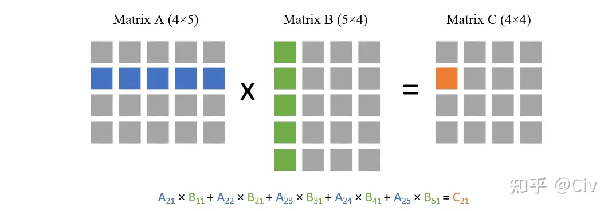
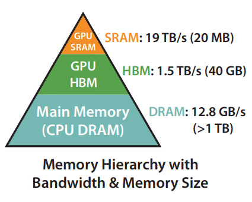
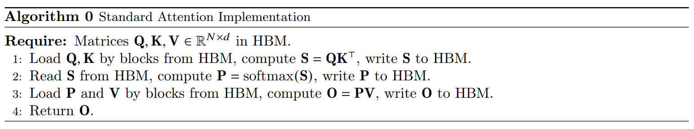
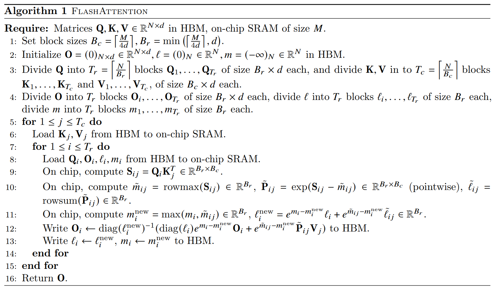
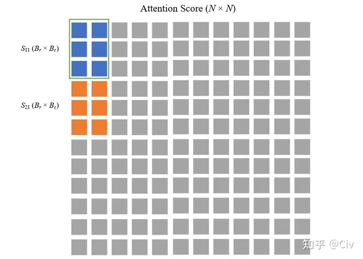
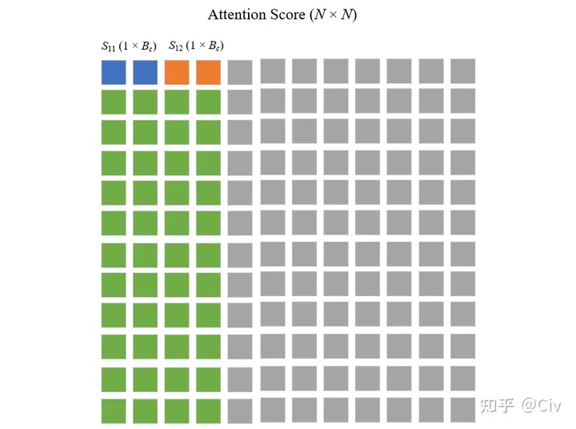
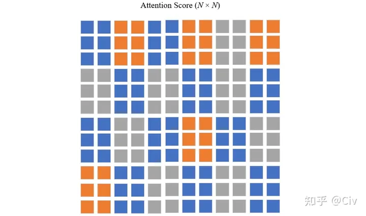
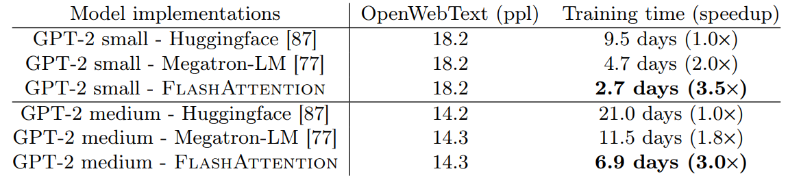

# Flash Attention
## Reference
- [FlashAttention图解（如何加速Attention）](https://zhuanlan.zhihu.com/p/626079753)
- [FlashAttention2详解（性能比FlashAttention提升200%）](https://zhuanlan.zhihu.com/p/645376942)
- [FlashAttention 的速度优化原理是怎样的？](https://www.zhihu.com/question/611236756/answer/3132304304)
- [FlashAttention: Fast and Memory-Efficient Exact Attention with IO-Awareness](https://arxiv.org/pdf/2205.14135.pdf)
## 背景
FlashAttention本身不难理解，但需要一点点耐心，因为它的工作方式不太直觉。其实大多数针对精确算法的优化，到最后一定是非直觉的技巧。

FlashAttention主要**解决Transformer计算速度慢和存储占用高的问题**。但与绝大多数Efficient Transformer把改进方法集中在降低模型的FLOPS（floating point operations per second）不同，FlashAttention将优化重点放在了降低**存储访问开销**（Memory Access Cost，MAC）上。

### Transformer的复杂度
大语言模型普遍以Transformer作为核心基础组件，而Transformer的核心计算部分是Self-Attention。在标准的Transformer计算中，给定大小为$(N, d)$的三个矩阵Q, K, V $\in \mathbb{R}^{N \times d} $, Self-Attention的计算如下：
$$S = QK^T \in \mathbb{R}^{N \times N} \tag{1}$$
$$P = softmax(S) \in \mathbb{R}^{N \times N} \tag{2}$$
$$O = PV \in \mathbb{R}^{N \times d} \tag{3}$$

其中Q, K, V由原始输入经线性变换得到; S在一些论文中被称为Attention Scores; P是对S进行逐行softmax得到的结果，可理解为Normalized Attention Scores，或Attention Weights；O是最终的输出；N是序列长度；d是维度。

由上述三个公式可知Self-Attention中最密集的计算主要包括公式（1）和公式（3）中的两个矩阵乘法。

在公式（1）中，两个相乘的矩阵大小分别为$(N \times d)$和$(d \times N)$。矩阵乘法的一种计算方式是使用第一个矩阵的每一行与第二个矩阵的每一列做点乘，如图1所示:

因为我们需要拿第一个矩阵的每一行去与第二个矩阵的每一列做点乘，所以总共就需要$N^2$次点乘。而每次点乘又需要$d$次乘法，所以总复杂度就为$O(dN^2)$。

上述分析中的复杂度$O(dN^2)$对应的base operator是“乘法”。因为加法的复杂度远小于乘法，所以可以忽略之。如果一定要算上加法，可以将复杂度对应的base operator理解为“乘加”即可。

同理可知，公式（3）中的矩阵乘法复杂度也为$O(dN^2)$。

因为这两个公式是串行执行的，所以Self-Attention的计算复杂度就为$O(dN^2)$：随序列长度 
$N$呈二次方增长。实际上，Self-Attention的空间复杂度也为$O(dN^2)$。

由于Self-Attention是Transformer的主要计算，所以通常也直接说Transformer的复杂度为$O(dN^2)$。正因为Transformer的复杂度随序列长度的增长呈二次方增长，所以通常基于Transformer的大语言模型的上下文长度都不会特别长（如早期的大模型普遍在2k、4k左右）。

显然，上下文长度的局限性也限制了大语言模型的应用场景，尤其是对输入长度要求比较高的场景。

### FLOPs & MAC
上文提到Transformer的计算复杂度是$O(dN^2)$。大$O$表示法关注的是计算量级与输入规模之间的关系，并不是具体的计算量。具体计算量通常用FLOPS体现。因为FLOPS直接定义了模型核心计算的密集程度，所以模型的的计算量FLOPS与模型的计算速度有很大关系。

学界有很多利用各种技巧来降低Transformer FLOPS的方法，通常将由这些方法改进得到的模型称为Efficient Transformer。但大多数Efficient Transformer通常只关注FLOPS。而实际上，FlashAttention的作者们发现，这些Efficient Transformer虽然能够有效降低模型的FLOPS，但它们的计算速度并没有显著降低。导致该现象的根本原因是模型的计算速度除了与FLOPS有很大关系，同时也与MAC（Memory Access Cost，存储访问开销）有关。

尤其是当计算本身已经很高效的情况下，MAC的开销更加不能忽略。MAC的开销主要来自两方面。一是从存储中读取数据；二是向存储中写数据。与CPU的情况类似，在GPU中，当需要计算时，需将数据从显存中读取并由计算单元进行计算操作。在计算完毕后，再写回到显存中。

熟悉CV的朋友可能会联想到ShuffleNet v2（缅怀前辈）。当时很多轻量化模型涌现，也是只关注FLOPS。ShuffleNet v2中却强调了MAC，这与FlashAttention背后的研究动机异曲同工。
为了弄清MAC对计算速度的影响，可以根据计算的密集程度，将operator分为两类：
#### Compute-bound：计算密集型
整个计算的耗时主要在于计算本身，对显存的读写几乎可以忽略。典型的计算包括大矩阵乘法、大channel size的卷积操作等。对于这类operator，它们的FLOPS决定了计算的时耗。

#### Memory-bound：存储访问密集型
整个计算的耗时主要集中在存储的访问上，计算本身耗时较低。典型的计算包括逐元素操作（ReLU，Dropout等）、以及Reduce操作（求和、softmax、BatchNorm等）。对于这类operator，它们的MAC决定了计算的时耗。

在绝大多数的神经网络中，因为含有大量的Memory-bound操作，所以MAC的开销都不能忽略。但绝大多数Efficient Transformer都忽略了MAC，所以虽然它们整体的FLOPS降低了，但计算时耗并没有降低。

## 核心思路
**FlashAttention的目标是降低MAC，即使代价是增加了FLOPS。**

要理解FlashAttention的优化MAC的方法，需要简单了解一下GPU的结构:

图2所示为A100的存储结构示意图。其中GPU的存储主要由两部分构成：HBM（High Bandwidth Memory）和SRAM（Static Random-Access Memory）。从图2中可看出，SRAM的读写速度远大于HBM，但其存储空间则远小于HBM。

标准self-attention的计算可以抽象为如下过程，它主要使用了HBM：

图3中一共包含八次HBM的矩阵读写操作。这八次读写操作分别为：
- 第一行对Q, K的读，共两次，对S的写一次，总共三次；
- 第二行对S读一次，对P写一次，总共两次；
- 第三行对P, V的读，共两次，对O的写一次，总共三次。

为了减少对HBM的读写，FlashAttention将参与计算的矩阵进行分块送进SRAM，来提高整体读写速度（减少了HBM读写）。但对于Self-Attention的计算来说，FlashAttention的分块计算方法并不直观、不自然，下一部分详细介绍。

## 原理
前文提到了FlashAttention的核心是对Self-Attention的计算进行分块计算。对于矩阵乘法而言，可以直接通过分块来达到分块计算的目的。但Self-Attention中有softmax计算，而softmax的分母包含与所有元素相关的求和项，所以对Self-Attention进行分块计算的真正难点在于对softmax的分块计算。

### Softmax的动态更新
接下来看一下对softmax进行分块计算的基本方法。先回顾一下softmax的计算公式。假设有维度为 
B的向量$x \in \mathbb{R}^B$，对$x$的softmax计算公式如下：
$$softmax(x_i) = \frac{e^{x_i}}{\sum_{j=1}^B{e^{x_j}}} \tag{4}$$

其中$x_i$为向量$x$的第$i$个分量。

因为softmax的计算公式中含有指数项，当指数项$e^{x_i}$中的$x_i$较大时, $e^{x_i}$的值也容易很大，从而在计算中出现溢出。为了避免溢出的问题，大多数深度学习框架中都使用了softmax的稳定版本。仍以向量$x$为例，稳定版的softmax的计算如下：
$$m(x) = max([x_1, x_2,...,x_B]) \tag{5}$$
其中$m(x)$为向量$x$中的最大值。
$$f(x) = [e^{x_1 - m(x)},..., e^{x_B - m(x)}] \tag{6}$$
其中$f(x)$是一个新的向量，其中每一项是在标准softmax每一项的基础上，在指数项中减去了一个最大值$m(x)$.
$$l(x) = \sum_{i}{f(x)_i} \tag{7}$$
其中$l(x)$是softmax分母中的求和项。为了后面方便描述，后文将公式（7）中的求和项称为“EXP求和项”。
$$softmax(x) = \frac{f(x)}{l(x)} \tag{8}$$

公式（8）中的分子$f(x)是向量，分母$l(x)$是标量，所以这里的除法是逐元素相除。

直觉上, softmax难以分块计算的主要原因是它的分母“EXP求和项”依赖于输入向量$x$中的每一个值。

基于上述公式（5）至公式（8）定义的稳定版softmax，接下来介绍softmax的分块计算方法的核心思想。

考虑一个大小为2B的向量$x \in \mathbb{R}^{2B}$，将其“一切为二”进行分块：$x = [x^{(1)}, x^{(2)}]$，其中$x^{(1)}, x^{(2)} \in \mathbb{R}^{B}$。换言之，子向量$x^{(1)}$是原向量$x$的前半部分；子向量$x^{(2)}$是原向量$x$的后半部分。

假设在分块计算中先处理$x^{(1)}$，再处理$x^{(2)}$。使用公式（5）至公式（8）对子向量$x^{(1)}$计算它的“局部softmax”（各公式具体含义可参照公式（5）至公式（8）进行理解）：
$$m(x^{(1)}) = max([x^{(1)}_1, x^{(1)}_2,...,x^{(1)}_B]) \tag{9}$$
$$f(x^{(1)}) = [e^{x^{(1)}_1 - m(x^{(1)})},..., e^{x^{(1)}_B - m(x^{(1)})}] \tag{10}$$
$$l(x^{(1)}) = \sum_{i}{f(x^{(1)})_i} \tag{11}$$
$$softmax(x^{(1)}) = \frac{f(x^{(1)})}{l(x^{(1)})} \tag{12}$$

显然由公式（9）至公式（12）计算得到的$softmax(x^{(1)})$并不是子向量$x^{(1)}$的最终结果，原因如下：
- 公式（10）中减去的最大值应该是整个向量$x$的最大值，而不是子向量$x^{(1)}$的最大值；
- 公式（12）中的分母的“EXP求和项”应该是关于整个向量$x$的求和项，而不仅仅只关于子向量 
$x^{(1)}$中的所有元素。

正因上述计算得到的$softmax(x^{(1)})$不是最终结果，所以将其称为“局部的”。

接下来将介绍通过保存额外的一些变量值，在处理完$x^{(2)}$后更新$x^{(1)}$的softmax值的方法。

在处理完子向量$x^{(1)}$后，保存$m(x^{(1)})$和$l(x^{(1)})$。相比于整个子向量$x^{(1)}$，仅保存这两个标量的开销要小的多。此外，还需要保存两个全局标量：$m_{max}$和$l_{all}$。
- $m_{max}$表示当前最大值，因为目前只处理完了$x^{(1)}$，所以$m_{max} = m(x^{(1)})$。
- $l_{all}$表示全局EXP求和项。因为目前只处理完了$x^{(1)}$，所以 $l_{all} = l({x^{(1)}})$.

接着采用类似$x^{(1)}$处理的方法来处理$x^{(2)}$，可得如下结果：
$$m(x^{(2)}) = max([x^{(2)}_1, x^{(2)}_2,...,x^{(2)}_B]) \tag{13}$$
$$f(x^{(2)}) = [e^{x^{(2)}_1 - m(x^{(2)})},..., e^{x^{(2)}_B - m(x^{(2)})}] \tag{14}$$
$$l(x^{(2)}) = \sum_{i}{f(x^{(2)})_i} \tag{15}$$
$$softmax(x^{(2)}) = \frac{f(x^{(2)})}{l(x^{(2)})} \tag{16}$$

同理，此时公式（16）得到的softmax也是“局部”而非“全局”的。但在处理完$x^{(2)}$之后，可以利用$x^{(2)}$的信息来更新之前保存的两个全局标量$m_{max}$和$l_{all}$:
$$m_{max}^{new} = max([m_{max}, m(x^{(2)})]) \tag{17}$$

公式（17）的含义很简单：更新后的全局最大值就是之前的最大值$m_{max}$和$x^{(2)}$的最大值中更大的那一个。

$$l_{all}^{new} = e^{m_{max} - m_{max}^{new}}l_{all} + e^{m_{x^{(2)}} - m_{max}^{new}}l(x^{(2)}) \tag{18}$$

公式（18）是更新全局EXP求和项的方法。公式（18）的正确性可以按如下推出。以$l({x^{(2)}})$为例， 我们说$l({x^{(2)}})$是“局部的”是因为$l({x^{(2)}})$到目前为止只用到了$x^{(2)}$的信息。 将$l({x^{(2)}})$更新至“全局”需要用到$x_{max}^{new}$。

把$l({x^{(2)}})$的计算公式（15）稍微展开可得：
$$l(x^{(2)}) = \sum_{i}{e^{x_i^{(2)} - m(x^{(2)})}} \tag{19}$$

可知导致$l({x^{(2)}})$是“局部”而非“全局”的原因是它减去的max值是“局部的”。所以只需要将这个max值替换为全局的即可。为此可以将$l({x^{(2)}})$如下变换：
$$
\begin{align}
l^{new}(x^{(2)}) =& l(x^{(2)}) \cdot e^{m(x^{(2)}) - m_{max}^{new}} \\
                 =& \sum_i{e^{x_i^{(2)} - m(x^{(2)})}} \cdot e^{m(x^{(2)}) - m_{max}^{new}} \\
                 =& \sum_i{e^{x_i{(2)}} - m_{max}^{new}}
\end{align}
\tag{20}
$$

此时的$l({x^{(2)}})$更新为“全局的”。

简而言之，当需要把某个$l$更新为“全局的”时，只要将其乘以一个项:$e^{m - m_{max}^{new}}$，其中$m$表示当前$l$对应的最大值，$m_{max}^{new}$表示当前最大值。

回到公式（18），可知其首先用了这种全局更新方法分别将$l_{all}$与$l(x^{(2)})$更新至全局，然后将它们求和得到当前的EXP求和项。基于上述更新$l$的方法，也能直接更新softmax值。参考公式（16），当前的分子和分母都是局部的，所以都需要更新至全局。

先看分子部分$f({x^{(2)}})$。$f({x^{(2)}})$由公式（14）定义，可将其做如下更新：
$$
\begin{align}
f^{new}(x^{(2)}) =& f(x^{(2)}) \cdot e^{m(x^{(2)}) - m_{max}^{new}} \\
                 =& [e^{x_1^{(2)} - m(x^{(2)})},...,e^{x_B^{(2)} - m(x^{(2)})}] \cdot e^{m(x^{(2)}) - m_{max}^{new}} \\
                 =& [e^{x_1{(2)}} - m_{max}^{new},...,e^{x_B{(2)}} - m_{max}^{new}]
\end{align}
\tag{21}
$$

再来看分母部分$l({x^{(2)}})$。我们其实只需要将分母由$l({x^{(2)}})$替换为 
$l_{all}^{new}$即可，这可以由如下公式办到：
$$\frac{softmax(x^{(2)}) \cdot l(x^{(2)})}{l_{all}^{new}} \tag{22}$$

$l_{all}^{new}$由公式（18）计算得到。

结合公式（21）和公式（22），$softmax(x^{(2)})$的更新可由如下实现：
$$softmax^{new}(x^{(2)}) = \frac{softmax(x^{(2)}) \cdot l(x^{(2)}) \cdot e^{m(x^{(2)}) - m_{max}^{new}}}{l_{all}^{new}} \tag{23}$$

仔细看公式（23），我们在更新$x^{(2)}$的softmax值时，用到了前面提到的额外保存的几个量：

- $x^{(2)}$的局部softmax值$softmax(x^{(2)})$
- $x^{(2)}$的局部EXP求和项 
- $x^{(2)}$的局部最大值$m(x^{(2)})$
- 全局最大值$m_{all}^{new}$
- 全局EXP求和项$l_{all}^{new}$

同理，可以将上面前三项中的$x^{(2)}$替换成$x^{(1)}$来对$x^{(1)}$的softmax值进行更新。所有更新过程都不需要用到$x^{(1)}$或$x^{(2)}$的向量值。

这就是FlashAttention中对softmax值进行动态更新的本质。上述其实是一个增量计算的过程。我们首先计算一个分块的局部softmax值，然后存储起来。当处理完下一个分块时，可以根据此时的**新的全局最大值**和**全局EXP求和项**来更新旧的softmax值。接着再处理下一个分块，然后再更新。当处理完所有分块后，此时的所有分块的softmax值都是“全局的”。

### 计算流程
下面详细解释图4中的FlashAttention伪代码，并以此说明其计算流程。

算法的输入包括：
- 存储于HBM中的Q, K, V $\in \mathbb{R}^{N \times d}$
- SRAM的大小M
#### Line 1：

根据SRAM的大小M和输入向量维度d选择合适的分块大小$B_c$和$B_r$。含义后文将解释。

#### Line2：
初始化一些变量，包括最终的输出$O \in \mathbb{R}^{N \times d}$；N维向量l用于记录每个position的EXP求和项；
N维向量m用于记录每个position的Attention Score中的最大值。

#### Line3 & Line4：

将矩阵Q, O沿着行方向分为$T_r$块，每一分块的大小为$B_r \times d$； 将向量l和向量m分为$T_r$块，每一个子向量大小为$B_r$。

将矩阵K, V沿着行方向分为$T_c$块，每一块的大小为$B_c \times d$。

简单画一个图来方便对应各个分块之间的关系，如图5所示。

#### Line 5：
外循环。因外循环由$T_c$控制，所以可知在遍历K, V。
#### Line 6：
将当前遍历中的$K_j$,$V_j$由HBM读入至SRAM。
#### Line 7：
内循环。内循环由$T_r$控制，所以可知在遍历Q, O, l, m。
#### Line 8：
将当前遍历中的$Q_i$,$O_i$, $l_i$, $m_i$由HBM读入至SRAM。
#### Line 9：
使用当前在遍历中的$Q_i$,$K_j$,计算分块的Attention Score: $S_{ij} = Q_iK_j^T \in \mathbb{R}^{B_r \times B_c}$
 。

在标准的Transformer计算中得到的Attention Score是一个$N \times N$的矩阵，如图6所示。

标准的Transformer需要计算的Attention Score包括整个矩阵（灰色）。各分块计算出的Attention Score如图中蓝色和橙色区域所示。
#### Line 10：
对分块的Attention Score $S_{ij}$，计算它每一行中的最大值$\hat{m}_{ij} = rowmax(S_{ij}) \in \mathbb{R}^{B_r}$

基于 $\hat{m}_{ij}$, 计算指数项 $\hat{P}_{ij} = exp(S_{ij} - \hat{m}_{ij}) \in \mathbb{R}^{B_r \times B_c}$。

然后再基于 $\hat{P}_{ij}$，计算EXP求和项 $\hat{l}_{ij} = rowsum(P_{ij}) \in \mathbb{R}^{B_r}$
 。

#### Line 11：
利用公式（17）和公式（18）分别更新$m_i$和$l_i$。
#### Line 12：

为了更好地理解这一行的公式，首先得明白多行一起计算的目的是Batch计算。例如在图6中，每一个小分块$S_{ij}$有多行（图中为3行），但行与行之间的数据不会有任何的交互，只是一种Batch计算的策略。真正的分块意义是在列上，因为softmax是沿着列方向进行的。所以为了方便理解，可以想象为$B_r$等于1，即每一次只计算图6中的一个大小为$(1 \times B_c)$的分块。

基于上述的简化方法，接下来看整个softmax的更新过程。我们用$S_i$来表示每一行的Attention Score，用$SM_i$表示每一行的softmax:

因为现在不考虑Batch计算了，所以每一次处理的Attention Score都是一个向量。如图7中的$S_{11}$，我们首先用公式（5）至公式（8）计算它的局部softmax，得到$SM_i$。此时$SM_i$中只有前两个位置有值，对应的是$S_{11}$的局部softmax值。

然后用相同的方法处理它下方的每一行（绿色部分的前两列），直接忽略。

接着处理$S_{12}$，同理首先用公式（5）至公式（8）计算它的局部softmax，然后用公式（23）对$SM_1$进行更新：

$$SM_1^{(new)} = \frac{SM_1 \cdot l_1 \cdot e^{m_1 - m_1^{new}}}{l_1^{new}} + \frac{\hat{P}_{12} \cdot e^{m_{12} - m_1^{new}}}{l_1^{new}} \tag{24}$$

其中$\hat{P}_{12}$等价于公式（6）的结果。

当处理到$S_{13}$时，继续套用公式（24）来更新即可：
$$SM_1^{(new)} = \frac{SM_1 \cdot l_1 \cdot e^{m_1 - m_1^{new}}}{l_1^{new}} + \frac{\hat{P}_{13} \cdot e^{m_{12} - m_1^{new}}}{l_1^{new}} \tag{25}$$

下面再进一步，直接尝试来更新输出$O_1$，而不仅仅是softmax值$SM_1$。方法其实很简单，只要在每次动态更新完softmax，乘上其对应的V的值即可：
$$O_1^{(new)} = \frac{O_1 \cdot l_1 \cdot e^{m_1 - m_1^{new}}}{l_1^{new}} + \frac{\hat{P}_{12} \cdot e^{m_{12} - m_1^{new}}}{l_1^{new}} \cdot V_2 \tag{26}$$

其中$V_2$对应的是$S_{12}$中的列数（2）。

拿着公式（26）与图4中的伪代码进行对比，可知图4中的公式仅仅是公式（26）的矩阵版本。到此，可以看到用公式（26）即可实现分块的Self-Attention计算。

#### Line 13：
更新$l_i$和$m_i$。
### MAC分析
self-attention实现:

根据参与计算的各矩阵大小，可以分析它的MAC次数（以访问单个float值为基准）。
- 第一行，读Q, K的MAC次数为$2Nd$，写S的MAC次数为$N^2$。
- 第二行，读S的MAC次数为$N^2$，写P的MAC次数为$N^2$。
- 第三行，读P的MAC次数为$N^2$, 读V的MAC次数为$Nd$，写O的MAC次数为$Nd$。

上述所有加起来的总MAC开销为$4Nd + 4N^2$。忽略掉其中的常数项，可以将复杂度写为$O(Nd + N^2)$。

再来看FlashAttention，主要关注图4中关于Q的开销：因为Q在内循环，它的MAC占绝大多数。
- 内循环很简单，一次完整的内循环需要读取完整的Q, MAC开销为$Nd$。
- 外循环决定了内循环执行的次数，即$T_c$次。$T_c = \left \lceil \frac{N}{B_c} \right \rceil = \left \lceil \frac{4dN}{M} \right \rceil$。忽略掉常数项，可知FlashAttention的开销为$O(N^2d^2M^{-1})$。

因为M(100KB)通常远远大于d(d是head dimension，通常64至128)，所以FlashAttention的MAC远小于标准的Transformer。

注意，在原论文中使用的复杂度符号是$\Theta$，而不是本文使用的$O$。这二者的区别在于, $O$表示的是上界，而$\Theta$表示的是精确界（既是上界，也是下界）。

本文用大$O$主要考虑大家比较熟悉大$O$表示法，并且在$\Theta$成立的情况下，其对应的大$O$也成立。

### Block-Sparse FlashAttention
为了进一步降低MAC，原论文设计了一种简单的Block-Sparse FlashAttention，如下图所示。

图9中，蓝色和橙色块都是正常参与计算的分块，用不同颜色是为了方便区分。图中灰色分块是被mask住的分块，这些分块不参与计算。因为部分分块不参与计算了，所以自然总的MAC就降低了。但Block-Sparse FlashAttention仍然是一种近似算法，不是精确的Transformer。

## 实验结果
这里只看一个关于计算效率的结果，如下图所示。

实验结论很简单，使用FlashAttention，可以明显地提高计算速度。