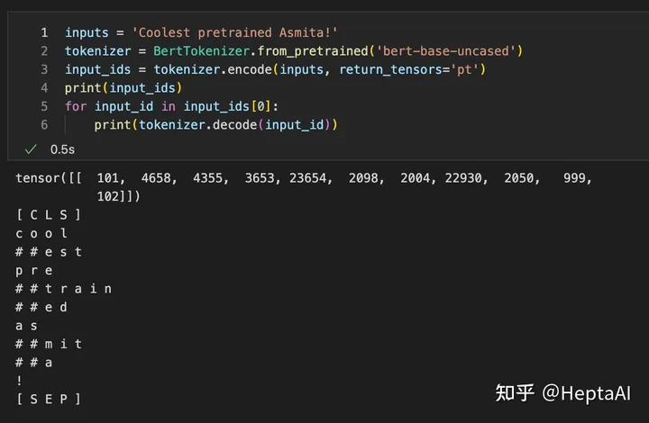
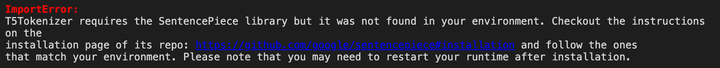
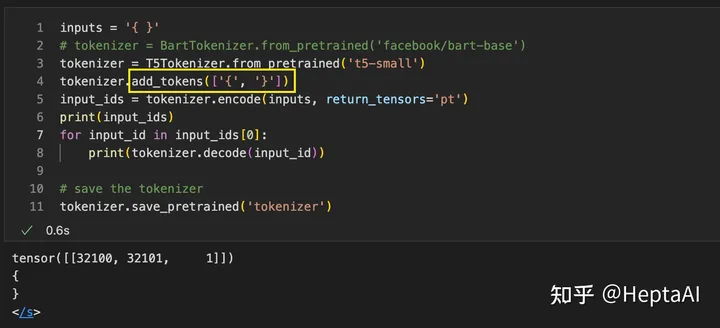
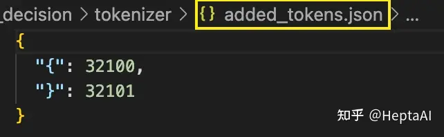
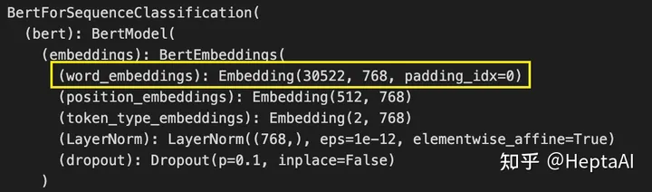
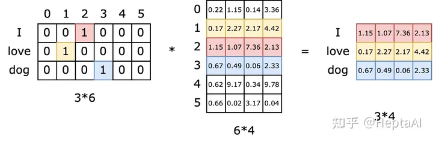

# Tokenizer
如果大家用过huggingface，对tokenizer肯定不会陌生。在使用模型前，都需要将sequence过一遍tokenizer，进去的是word序列（句子），出来的是number序列。但是，HF的tokenizer到底在做什么？事实上，tokenizer总体上做三件事情：

1. 分词。tokenizer将字符串分为一些sub-word token string，再将token string映射到id，并保留来回映射的mapping。从string映射到id为tokenizer encode过程，从id映射回token为tokenizer decode过程。映射方法有多种，例如BERT用的是WordPiece，GPT-2和RoBERTa用的是BPE等等，后面会详细介绍。
2. 扩展词汇表。部分tokenizer会用一种统一的方法**将训练语料出现的且词汇表中本来没有的token加入词汇表**。对于不支持的tokenizer，用户也可以手动添加。
3. **识别并处理特殊token**。特殊token包括`[MASK]`, `<|im_start|>`, `<sos>`, `<s>`等等。tokenizer会将它们加入词汇表中，并且保证它们在模型中不被切成sub-word，而是完整保留。
## 分词粒度
我们首先来看一下几种不同的分词粒度。最直观的分词是单词分词法（word base）。**单词分词法**将一个**word**作为最小元，也就是根据空格或者标点分词。拿[大模型中的分词器tokenizer](https://zhuanlan.zhihu.com/p/620508648)一文中的例子来说，Today is Sunday用word-base来进行分词会变成['Today', 'is', 'Sunday']。最详尽的分词是**单字分词法**（character-base）。单字分词法会穷举所有出现的**字符**，所以是最完整的。在上面的例子中，单字分词法会生成['T', 'o', 'd', ..., 'a', 'y']。另外还有一种最常用的、介于两种方法之间的分词法叫**子词分词法**，会把上面的句子分成**最小可分**的子词['To', 'day', 'is', 'S', 'un', 'day']。子词分词法有很多不同取得最小可分子词的方法，例如BPE（Byte-Pair Encoding，字节对编码法），WordPiece，SentencePiece，Unigram等等。接下来我们具体看看各大主流模型用的是什么分词法。

## 常用tokenizer
### GPT族：Byte-Pair Encoding (BPE)
从GPT-2开始一直到GPT-4，OpenAI一直采用BPE分词法。这种方法的子词构造算法是这样的：

1. 统计输入中所有出现的单词并在每个单词后加一个单词结束符</w> -> ['hello</w>': 6, 'world</w>': 8, 'peace</w>': 2]
2. 将所有单词拆成单字 -> {'h': 6, 'e': 10, 'l': 20, 'o': 14, 'w': 8, 'r': 8, 'd': 8, 'p': 2, 'a': 2, 'c': 2, '</w>': 3}
3. 合并最频繁出现的单字(l, o) -> {'h': 6, 'e': 10, 'lo': 14, 'l': 6, 'w': 8, 'r': 8, 'd': 8, 'p': 2, 'a': 2, 'c': 2, '</w>': 3}
4. 合并最频繁出现的单字(lo, e) -> {'h': 6, 'lo': 4, 'loe': 10, 'l': 6, 'w': 8, 'r': 8, 'd': 8, 'p': 2, 'a': 2, 'c': 2, '</w>': 3}
5. 反复迭代直到满足停止条件
显然，这是一种贪婪的算法。在上面的例子中，'loe'这样的子词貌似不会经常出现，但是当语料库很大的时候，诸如est，ist，sion，tion这样的特征会很清晰地显示出来。

在获得子词词表后，就可以将句子分割成子词了，算法见下面的例子（引自[文章](https://zhuanlan.zhihu.com/p/378323693)）：
```
# 给定单词序列
["the</w>", "highest</w>", "mountain</w>"]

# 从一个很大的corpus中排好序的subword表如下
# 长度 6         5           4        4         4       4          2
["errrr</w>", "tain</w>", "moun", "est</w>", "high", "the</w>", "a</w>"]

# 迭代结果
"the</w>" -> ["the</w>"]
"highest</w>" -> ["high", "est</w>"]
"mountain</w>" -> ["moun", "tain</w>"]
```
注意，在上述算法执行后，如果句子中仍然有子字符串没被替换但所有subword都已迭代完毕，则将剩余的子词替换为特殊token，如<unk> 。从这里大家也可以发现了，原则上<unk>这个token出现的越少越好，所以我们也往往用<unk>的数量来评价一个tokenizer的好坏程度，这个token出现的越少，tokenizer的效果往往越好。

管中窥豹，根据BPE算法，我们可以发现，tokenizer基本上是无法并行的，因为存在大量if-else的branch。学过GPU Programming的同学应该知道，conditional branch越多，GPU提供的加速越有限，有时候还会造成负加速，因为数据传输有很大开销。这就是为什么在tokenizing的时候，我们看到GPU util都是0。

### BERT族：Word-Piece
Word-Piece和BPE非常相似，BPE使用出现最频繁的组合构造子词词表，而Wordpiece使用出现概率最大的组合构造子词词表。换句话说，WordPiece每次选择合并的两个子词，通常在语料中以相邻方式同时出现。比如说 P(ed) 的概率比P(e) + P(d)单独出现的概率更大（可能比他们具有最大的互信息值），也就是两个子词在语言模型上具有较强的关联性。这个时候，Word-Piece会将它们组合成一个子词。

有关BERT的tokenizer还有一个重点：BERT在使用Word-Piece时加入了一些特殊的token，例如[CLS]和[SEP]。我们可以自己试一下：


发现BERT在句首加上了[CLS]，句尾加上了[SEP]，而且对coolest做了子词分解，对词根est加上了##来表示这是一个后缀。对于没有出现在词汇表里的单词例如asmita（是个印度人名），BERT所用的Word-Piece tokenizer会将它分解为Word-Piece算法形成的子词词汇表中存在的as，mit和a，组成一个子词。

### 多语言支持：Sentence-Piece
大家在使用HF的时候有时候会提示安装Sentence-Piece，这个包其实是HF里面大量模型会调用的包，例如ALBERT，XLM-RoBERTa和T5：


这个包主要是为了多语言模型设计的，它做了两个重要的转化：
1. 以unicode方式编码字符，将所有的输入（英文、中文等不同语言）都转化为unicode字符，解决了多语言编码方式不同的问题。
2. 将空格编码为‘_’， 如'New York' 会转化为['_', 'New', '_York']，这也是为了能够处理多语言问题，比如英文解码时有空格，而中文没有， 这种语言区别。
## 词汇表不全问题
但是，也是因为这两个转化，SentencePiece的tokenizer往往会出现词汇表不全的问题。下面是部分SentencePiece中可能出现的问题：

|字符|	识别子词|
|--|--|
|{ }|	`<unk>`|
|< >|	`<unk>`|
|~|	`<unk>`|
|\n|	`空格`|
如果某个token被识别成`<unk>`，那它就无法与其他也被识别成`<unk>`的token区分开来。例如在训练的时候有大量{hello world}的样本，在输出的时候就会变成`<unk>` hello world `<unk>` 的样本。

这些问题不存在于WordPiece中。这是因为SentencePiece需要对多语言情况进行优化，有些token迫不得已要被删掉。想要加上某些本来tokenizer中不存在的token，可以使用`add_tokens()`方法。


使用后，保存的文件夹里面会出现一个added_tokens.json文件，里面就包含这两个新的token。这个时候再load这个tokenizer，这两个token就可以被模型识别了。


这之后，还需要告诉模型我已经更新了词汇表，使用`model.resize_token_embeddings(len(tokenizer))`。完整的添加例子如下：

from transformers import AutoTokenizer, AutoModel
```
# pick the model type
model_type = "roberta-base"
tokenizer = AutoTokenizer.from_pretrained(model_type)
model = AutoModel.from_pretrained(model_type)

# new tokens
new_tokens = ["new_token"]

# check if the tokens are already in the vocabulary
new_tokens = set(new_tokens) - set(tokenizer.vocab.keys())

# add the tokens to the tokenizer vocabulary
tokenizer.add_tokens(list(new_tokens))

# add new, random embeddings for the new tokens
model.resize_token_embeddings(len(tokenizer))
```
词汇表不全的问题在Word-Piece和BPE中也存在，在使用tokenizer的时候要格外小心。

## 各路语言模型中的tokenizer
我整理了一下各大LM用的tokenizer和对应的词汇表大小：

|LM	|Tokenizer|	Vocabulary Size|
|---|---------|----------------|
|BERT|	Word-Piece|	30k|
|ALBERT|	Sentence-Piece|	30k|
|RoBERTa|	BPE|	50k|
|XLM-RoBERTa|	Sentence-Piece|	30k|
|GPT|	SpaCy|	40k|
|GPT-2|	BPE|	50k|
|GPT-3|	BPE|	50k|
|GPT-3.5 (ChatGPT)|	BPE|	-|
|GPT-4|	BPE|	-|
|T5|	Sentence-Piece|	30k|
|Flan T5|	Sentence-Piece|	30k|
|BART|	Word-Piece|	50k|
另外，有大佬做了各大LLM的词汇表大小和性能：

|名称|	词表长度↑|	中文平均长度↓|	英文平均长度↓|	中文处理时间↓|	英文处理时间↓|
|----|----------|--------------|--------------|--------------|--------------|
|LLaMA|	32000|	62.8|	32.8|	02:09|	01:37|
|BELLE|	79458|	24.3|	32.1|	00:52|	01:27|
|MOSS|	106072|	24.8|	28.3|	07:08|	00:49|
|GPT4|	50281|	49.9|	27.1|	00:07|	00:08|
|BLOOM/Z|	250680|	23.4|	27.6|	00:46|	01:00|
|ChatGLM|	130344|	23.6|	28.7|	00:26|	00:39|
更多关于tokenizer的知识可以参见huggingface的官方博客：[Summary of the tokenizers](https://link.zhihu.com/?target=https%3A//huggingface.co/docs/transformers/tokenizer_summary)。

# Embedding Layer
tokenize完的下一步就是将token的one-hot编码转换成更dense的embedding编码。在ELMo之前的模型中，embedding模型很多是单独训练的，而ELMo之后则爆发了直接将embedding层和上面的语言模型层共同训练的浪潮（ELMo的全名就是Embeddings from Language Model）。不管是哪种方法，Embedding层的形状都是一样的。我们举个例子来看看embedding层是怎么工作的。在huggingface中，seq2seq模型往往是这样调用的：

```
input_ids = tokenizer.encode('Hello World!', return_tensors='pt')
output = model.generate(input_ids, max_length=50)
tokenizer.decode(output[0])
```
上面的代码主要涉及三个操作：tokenizer将输入encode成数字输入给模型，模型generate出输出数字输入给tokenizer，tokenizer将输出数字decode成token并返回。

例如，如果我们使用T5TokenizerFast来tokenize'Hello World!'，则：

1. tokenizer会将token序列 ['Hello', 'World', '!'] 编码成数字序列[8774, 1150, 55, 1]，也就是['Hello', 'World', '!', '</s>']，然后在句尾加一个</s>表示句子结束。
2. 这四个数字会变成四个one-hot向量，例如8774会变成[0, 0, ..., 1, 0, 0..., 0, 0]，其中向量的index为8774的位置为1，其他位置全部为0。假设词表里面一共有30k个可能出现的token，则向量长度也是30k，这样才能保证出现的每个单词都能被one-hot向量表示。
3. 也就是说，一个形状为 (4)的输入序列向量，会变成形状为(4, 30k)的输入one-hot向量。为了将每个单词转换为一个word embedding，每个向量都需要被被送到embedding层进行dense降维。
现在思考一下，多大的矩阵可以满足这个要求？没错，假设embedding size为768，则矩阵的形状应该为(30k, 768)，与BERT的实现一致：


## 理解Embedding矩阵
Embedding矩阵的本质就是一个查找表。由于输入向量是one-hot的，embedding矩阵中有且仅有一行被激活。行间互不干扰。这是什么意思呢？如下图所示，假设词汇表一共有6个词，则one-hot表示的长度为6。现在我们有三个单词组成一个句子，则输入矩阵的形状为(3,6)。然后我们学出来一个embedding矩阵，根据上面的推导，如果我们的embedding size为4，则embedding矩阵的形状应该为(6, 4)。这样乘出来的输出矩阵的形状应为(3, 4)。


我在图中用不同颜色标明了三个subword embedding分别的计算过程。对于第一个单词'I'，假设其one-hot编码为[0,0,1,0,0,0] ，将其与embedding矩阵相乘，相当于取出embedding矩阵的第3行（index为2）。同理，对于单词'love'，相当于取出embedding矩阵的第二行（index为1）。这样一来大家就理解了，embedding矩阵的本质是一个查找表，每个单词会定位这个表中的某一行，而这一行就是这个单词学习到的在嵌入空间的语义。