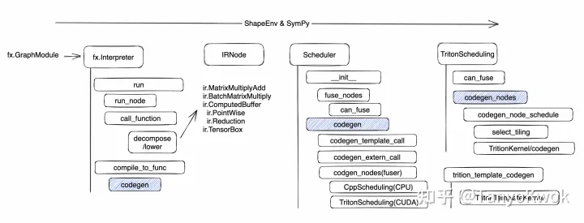

# PyTorch
## Reference
- [github](https://github.com/pytorch/pytorch)
- [官方文档](https://pytorch.org/docs/stable/index.html)
## Modules
### dynamo
[`dynamo`]()是pytorch编译器的前端, 主要是通过cpython进行图捕获

可以通过[depyf](https://github.com/thuml/depyf)工具dump出反编译的python代码, 调试非常好用!

#### dynamo遇到函数调用
如果被调用的函数可以表达成一整个完整的计算图而不涉及任何其他内容,则这个函数生成的计算图将被融合到大计算图中; 否则, 这个函数调用将导致一次计算图中断, 而函数内根据情况可以再生成子计算图
### inductor
`inductor`是pytorch编译器的默认后端, 通过openai的[Triton](../ai_compiler/Triton)提供核函数编译支持
#### Define-By-Run And Symbolic Shapes

全程均发生在Python环境中, 有以下好处:
1. 借助python层的`__torch_dispatch__`实现丰富的自定义功能
2. 借助python层的`fx.Interpreter`完成对`fx.GraphModule`的解析和预先运行. torch ops的decompose和lowering在这一阶段完成, 同时还有一些常量折叠和化简
3. 借助 python 层级的 duck typing 和 monkey patch 完成结构和类型方面的变化
4. 贯穿始终的 ShapeEnv 和 SymPy，结合 python 的 callback 函数，解释器对 FakeTensor 和 Symblic Shape 部分meta信息的预先执行，将极大地提升了 Inductor 对 alias mutation，动态 Shape/Broadcast 和 Layout 的支持能力。
#### Triton Fusion & Template CodeGen
对访存密集型算子进行Fusion,对计算密集型进行模板化和组合.

