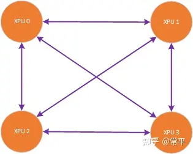
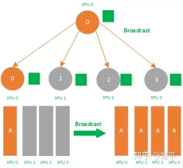
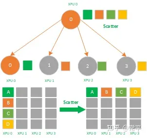
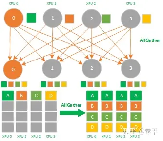
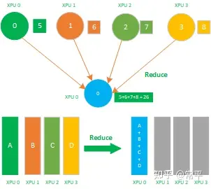
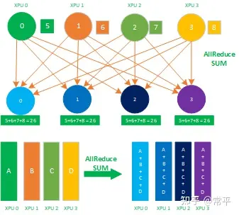

# 集合通信原语
## Reference
- [分布式训练 – 第3篇 - 分布式训练常用的集合通信及其通信原语](https://zhuanlan.zhihu.com/p/493092647)
## 概述
集合通信（Collective Communications）是一个进程组的所有进程都参与的全局通信操作，其最为基础的操作有 发送send、接收receive、复制copy、组内进程栅障同步Barrier以及节点间进程同步(signal +wait )，这几个最基本的操作经过组合构成了一组通信模板也叫通信原语，比如：1对多的广播broadcast、多对1的收集gather、多对多的收集all-gather、1对多的发散scatter、多对1的规约reduce、多对多的规约all-reduce、组合的规约与发散reduce-scatter、多对多的all-to-all等，集合通信的难点在于通信效率以及网络硬件连接拓扑结构的最佳适用。

## 通信原语
以一台集成了4张训练加速卡的服务器为例，如下图，服务器内四张训练加速卡是全连接的，物理连接方式可以是私有物理互联协议，比如CXL、NVLINK，也可以是PCIe、InfiniBand、Ethernet等，本文将以此物理拓扑结构描述集合通信中常用的几组通信原语。

### Broadcast
Broadcast属于1对多的通信原语，一个数据发送者，多个数据接收者，可以在集群内把一个节点自身的数据广播到其他节点上。如下图所示，圈圈表示集群中的训练加速卡节点，相同的颜色的小方块则代表相同的数据。当主节点 0 执行Broadcast时，数据即从主节点0被广播至其他节点。

Broadcast是数据的1对多的同步，它将一张XPU卡上的数据同步到其他所有的XPU卡上，其应用场景有：
- 数据并行的参数初始化，确保每张卡上的初始参数是一致的；
- allReduce里的 broadcast + reduce组合里的broadcast操作；
- 分布式训练parameter server 参数服务器结构里的 master节点 broadcast 数据到worker节点，再从worker节点reduce数据回master节点里的broadcast操作；

### Scatter
同Broadcast一样，Scatter也是一个1对多的通信原语，也是一个数据发送者，多个数据接收者，可以在集群内把一个节点自身的数据发散到其他节点上。与Broadcast不同的是Broadcast把主节点0的数据发送给所有节点，而Scatter则是将数据的进行切片再分发给集群内所有的节点，如下图所示，不相同的颜色的小方块代表不相同的数据，主节点 0 将数据分为四份分发到了节点0-3。

Scatter是数据的1对多的分发，它将一张XPU卡上的数据进行分片再分发到其他所有的XPU卡上，他的反向操作对应Gather，其应用场景有：
- ReduceScatter组合里的 Scatter操作；
- 模型并行里初始化时将模型scatter到不同的XPU上；

### Gather
Gather操作属于多对1的通信原语，具有多个数据发送者，一个数据接收者，可以在集群内把多个节点的数据收集到一个节点上，如下图所示，不相同的颜色的小方块代表不相同的数据。

Gather是数据的多对1的收集，它将多张XPU卡上的数据收集到1张XPU卡上，他的反向操作对应Scatter，其应用场景有：
- ReduceScatter组合里的 Scatter操作；

### AllGather
AllGather属于多对多的通信原语，具有多个数据发送者，多个数据接收者，可以在集群内把多个节点的数据收集到一个主节点上（Gather），再把这个收集到的数据分发到其他节点上（broadcast），即收集集群内所有的数据到所有的节点上。

AllGather是数据的多对多的同步全收集，它将多张XPU卡上的数据收集到多张XPU卡上，可以看做Gather + Broadcast的操作组合，它的反向操作对应ReduceScatter，其最应用场景有：
- AllGather可应用于模型并行；
- 模型并行里前向计算里的参数全同步，需要用allgather把模型并行里将切分到不同的XPU上的参数全同步到一张XPU上才能进行前向计算。

### Reduce
Reduce属于多对1的通信原语，具有多个数据发送者，一个数据接收者，可以在集群内把多个节点的数据规约运算到一个主节点上，常用的规约操作符有：求累加和SUM、求累乘积PROD、求最大值MAX、求最小值MIN、逻辑与 LAND、按位与BAND、逻辑或LOR、按位或BOR、逻辑异或LXOR、按位异或BOXR、求最大值和最小大的位置MAXLOC、求最小值和最小值的位置MINLOC等，这些规约运算也需要加速卡支持对应的算子才能生效。

Reuduce操作从集群内每个节点上获取一个输入数据，通过规约运算操作后，得到精简数据，如下图的SUM求累加和：节点0数值 5、节点1数值6、节点2数值7、节点3数值8，经过SUM运算后 累积和为 26，即得到更为精简的数值，在reduce原语里回会去调用 reduce SUM算子来完成这个求和累加。

Reduce是数据的多对1的规约运算，它将所有张XPU卡上的数据规约（比如SUM求和）到1张XPU卡上，其应用场景有：
- AllReduce里的 broadcast + reduce组合里的reduce操作；
- ReduceScatter组合里的 reduce操作；
- 分布式训练parameter server 参数服务器结构里的 master节点 broadcast 数据到worker节点，再从worker节点reduce数据回master节点里的reduce操作；

### ReduceScatter
ReduceScatter属于多对多的通信原语，具有多个数据发送者，多个数据接收者，其在集群内的所有节点上都按维度执行相同的Reduce规约运算，再将结果发散到集群内所有的节点上，Reduce-scatter等价于节点个数次的reduce规约运算操作，再后面执行节点个数的scatter次操作，其反向操作是AllGather。

如下图所示，先reduce操作 XPU 0-3的数据reduce为 A(A0+A1+A2+A3) + B(B0 + B1 +B2 + B3) + C(C0 + C1 + C2 + C3) + D(D0 + D1 + D2 + D3 ) 到一张XPU上，再进行分片scatter到集群内所有的XPU卡上。

ReduceScatter是数据的多对多的reduce + scatter运算，它将所有的XPU卡上的数据先规约（比如SUM求和）到1张XPU卡上，再进行scatter，其应用场景有：
- ReduceScatter即可应用于数据并行也可应用于模型并行；
- 数据并行allReduce里的 ReduceScatter+ Allgather组合里的ReduceScatter操作；
- 模型并行里在前向allgather后的反向计算里的ReduceScatter；

### AllReduce
AllReduce属于多对多的通信原语，具有多个数据发送者，多个数据接收者，其在集群内的所有节点上都执行相同的Reduce操作，可以将集群内所有节点的数据规约运算得到的结果发送到所有的节点上。AllReduce操作可通过在主节点上执行Reduce + Broadcast或ReduceScatter + AllGather实现，如下图所示：先在主节点上执行reduce得到规约累加和26，再把这个累加和26 broadcast到其他的节点，这样整个集群内，每个节点的数值就都保持一致。

AllReduce是数据的多对多的规约运算，它将所有的XPU卡上的数据规约（比如SUM求和）到集群内每张XPU卡上，其应用场景有：
- AllReduce应用于数据并行；
- 数据并行各种通信拓扑结构比如Ring allReduce、Tree allReduce里的 allReduce操作；

### All-To-All
All-To-All操作每一个节点的数据会scatter到集群内所有节点上，同时每一个节点也会Gather集群内所有节点的数据。ALLTOALL是对ALLGATHER的扩展，区别是ALLGATHER 操作中，不同节点向某一节点收集到的数据是相同的，而在ALLTOALL中，不同的节点向某一节点收集到的数据是不同的，如下图所示

AllToAll是数据的多对多的转置，它将所有张XPU卡上的数据转置到所有的XPU卡上，其主要应用场景有：
- AllToAll应用于模型并行；
- 模型并行里的矩阵转置；
- 数据并行到模型并行的矩阵转置；

### Send 与 Receive
数据或参数在不同XPU之间的发送与接收。

### Barrier
BARRIER同步操作会阻塞所有的调用者直到所有的组内成员都调用了它， 用于一个集合通信子中所有进程的同步，调用函数时进程将处于等待状态，直到通信子中所有进程 都调用了该函数后才继续执行。

### Signal与Wait
Signal与Wait属于记录型信号量机制： wait(s)，signal(s)可用于解决进程间的同步问题，在通信原语里从一个节点发送一个数据到另外一个节点时，会同时signal一个event值到对端，对端的wait操作接收到这个event时会返回一个确认给signal，这样保证在节点的进程间进行数据的同步操作。

## 小结
在分布式训练过程中，深度学习训练框架不会去直接操作底层的通信网络，而是通过使用网络通信库来完成数据的集合通信，各家AI芯片加速卡厂家都会提供私有的网络通信库比如：xxx-AWARE OpenMPI或xCCL来完成这个底层通信硬件的屏蔽与抽象。在分布式训练集群里网络通信硬件连接样式多种多样，可以是Ethernet、InfiniBand 、RoCE v2/v1 等也可以是CXL、NVLINK等私有协议，这就要求在通信的后端层根据各个厂家的自己的SDK开发库接口，根据实际情况实现 各自的网络通信库，比如cuda-aware MPI、NCCL、NVSHMEM，以及根据实际的网络拓扑组合完成对应的最有效的网络拓扑算法。