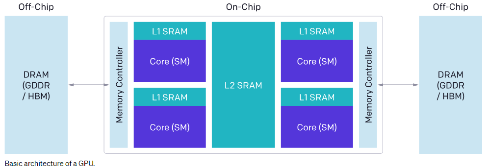
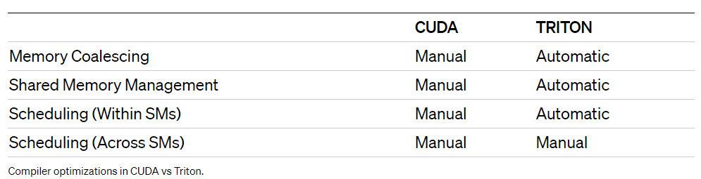
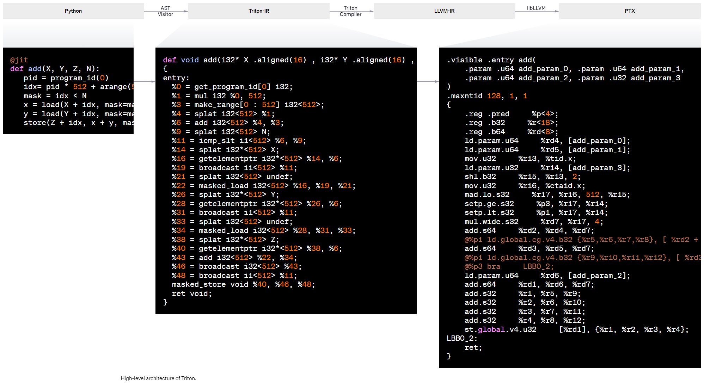
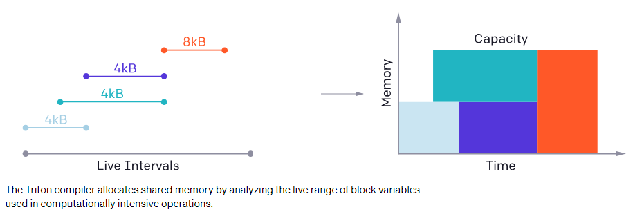

# Triton
## Reference
- [home page](https://openai.com/research/triton)
- [官方文档](https://triton-lang.org/main/getting-started/tutorials/index.html)
- [github 仓库](https://github.com/openai/triton)
- 
## 介绍
### GPU基本架构  

### 高性能GPU编程要点
1. 来自DRAM(GDDR/HBM, 也就是显存)的内存传输(H2D/D2H)尽量合并为大型事务(小数据块合并为大数据块, 可以减少指令的数量),从而利用现代内存接口的大总线带宽
2. 数据尽量存储到 SRAM(缓存)中重用，尽量降低cache miss
3. 在流式多处理器(SM)之间和内部仔细分区和调度计算, 以促进指令/线程级并行性. 并利用专用 ALU(例如 TensorCore)

Triton遵循上面的要点,然后完全自动化这些优化，以便开发人员可以更好地专注于其并行代码的高级逻辑(也就是让开发者专注于算子逻辑,而不是专注于编写CUDA代码针对GPU去调参)  
另外Triton不会做跨SM的优化(如tiling, SM间同步):  

### 编程模型
Triton与Numba相似: 核函数被定义为经过装饰的Python函数, 并在不同的program_id上同时启动(同一个grid)  
Triton其实就是在想方设法地简化CUDA编程,同时利用自己的编译器对核函数进行优化
- 详情见[language](language/intro.mm.md)
### 高层系统架构
Triton的良好性能来自于以[Triton-IR](./triton_ir.mm.md)为中心的模块化系统架构, Triton-IR是一种基于LLVM的中间表示，其中多维值块是一等公民(这一句是机翻官网的,待理解后修改)。

1. 装饰器@triton.jit遍历Python函数的[抽象语法树(AST)](../basic/ast.mm.md)，通过[SSA](../basic/ssa.mm.md)构造算法生成Triton-IR
2. 生成的IR代码由编译器后端进行简化, 优化和自动并行化, 然后转换为高质量的[LLVM-IR](../LLVM), 最终转换为[PTX](../../../GPU/cuda/NVPTX.mm.md),从而在NVIDIA [GPU](../../../GPU)上运行
### 编译器后端
- **blocked program representations**(分块的编程表示) 非常有用,也可以很方便的进行优化  

## Triton和CUDA
Triton 和 CUDA 本质上都是用来写 kernel 的, 而且 CUDA 相对来说更加 low-level 一些
对比:  
1. Triton 和 CUDA 的大体结构结构都是一样的: 定义kernel function --> 确定 kernel function "循环" 执行多少次 --> 调用 kernel function. 而且, 为了可行性, Triton 把 CUDA 中 pointer 的概念引入到 python 里面
2. Triton 相对于 CUDA 做了一些简化
    - Triton里, kernel function处理数据的量级是Block,所以在确定"循环次数"的时候也是在确定有多少这样的block.
    - CUDA里,kernel function处理的对象是一个个scalar,在确定"循环次数"的时候也是在确定有多少这样的scalar
    - CUDA中的"循环次数"是有分级的,分别是thread, thread block, thread grid. 多个thread构成构成一个block,多个block构成一个grid.在这三个级别中,可以保证同一个block中不同的thread之间有共享的`shared memory`,因为他们是可以同步和通信的(由GPU硬件决定)
    - CUDA 里面的 thread block并不能和 Triton 的 block 等价

## Lowering
