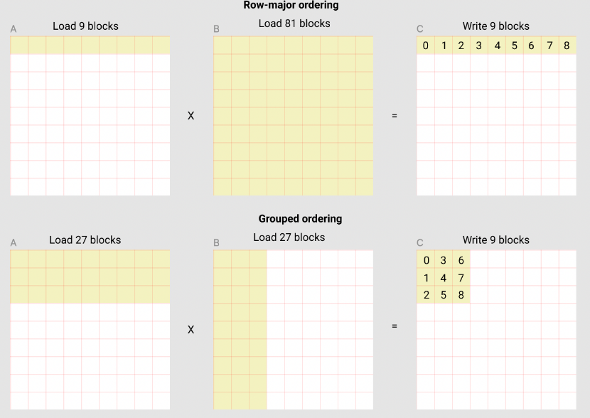

# triton language
## 语言特性
以官方文档中的[`Matrix Multiplication`](https://triton-lang.org/main/getting-started/tutorials/03-matrix-multiplication.html)为例
### Triton通过指针来表示变量  
triton本质上是追求效率的, 而GPU编程中最有效的优化手段通常就是memory IO(因为计算一般是不能省的), 所以triton希望用这种方式让用户`be aware of the cost of data loading`
### `tl.constexpr`代表kernel的超参数  
编译器会在编译的时候搜索这个超参数,因为:
    - kernel的输入形状会变
    - 执行kernel的硬件规格也不一样  
所以找到一组合适的超参对于优化很重要
### `pid = tl.program_id(axis=0)`  
我们写的kernel其实会被重复执行很多次,每次运行会处理一部分数据,直到所有数据处理完  
但这里并没有看到循环, 这里的`program_id`就是这个"虚拟的循环"(实际是并行)的index(第几次循环)  
这里的`axis=0`代表是第一层循环, 如果还有`axis=1`,说明还有嵌套的第二层  
另外,我们在调用kernel时,也需要说明这个循环有几层,每层多少次,这就是`grid`的概念
### grid
    ```
    grid = lambda META: (
            triton.cdiv(M, META['BLOCK_SIZE_M']) * triton.cdiv(N, META['BLOCK_SIZE_N']),
        )
    matmul_kernel[grid](
            a, b, c,
            M, N, K,
            a.stride(0), a.stride(1),
            b.stride(0), b.stride(1),
            c.stride(0), c.stride(1),
            ACTIVATION=activation
        )
    ```
可以看到`grid`是一个函数,它的输入就是`matmul_kernel`的输入, 通过拿到`matmul_kernel`的输入(kwargs)来计算`grid`. 这个例子中`grid`是一维的,正好和`pid = tl.program_id(axis=0)`对应
### 计算
我们要计算的是:$C=A*B$, A的尺寸: $M*K$, B的尺寸: $K*M$, C的尺寸: $M*N$
假设每次"循环"算的大小是$BLOCK\_SIZE\_M * BLOCK\_SIZE\_N$,那么总共要"循环"$\frac{M}{BLOCK\_SIZE\_M} * \frac{N}{BLOCK\_SIZE\_N}$ (所以这里也能解释上面的grid)
### pid
上面确定了"循环"的次数,但是按照什么顺序循环有很多不同的选择,同时不同的选择的效率也不一样
 
上图中关注矩阵C,每一个黄色小块的大小是$BLOCK\_SIZE\_M * BLOCK\_SIZE\_N$, 也就是一个block  
上图展示了两种方式:`row-major ordering`和`grouped ordering`  
第二种方式更好, 因为数据的reuse更好,可以提高cache命中率
### power-of-two
一般取数据会找一个最小的但是大于BLOCK_SIZE 的 2^N 的数字:
```
 P2 = int(2 ** (math.ceil(math.log2(x.shape[1]))))
```
或内置函数`triton.next_power_of_2`  
原因:
1. pointer 与 thread 息息相关, 一个 scalar 对应一个 pointer/thread
2. 对于reduce操作,有 power-of-two 个 thread 是最高效的


