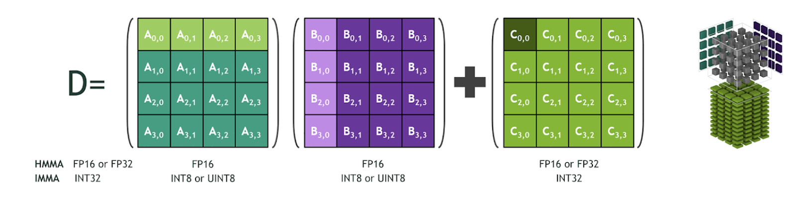
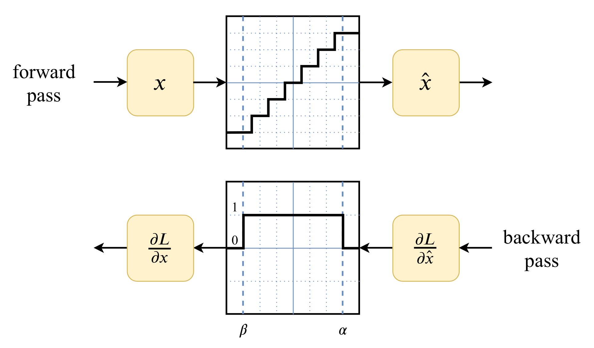

# Quantization
原文出处: https://leimao.github.io/article/Neural-Networks-Quantization/
## Introduction
Quantization refers to techniques for performing computations and storing tensors at lower bit-widths than floating point precision. A quantized model executes some or all of the operations on tensors with integers rather than floating point values. This allows for a more compact model representation and the use of high performance vectorized operations on many hardware platforms. This technique is in particular useful at the inference time since it saves a lot of inference computation cost without sacrificing too much inference accuracies.

So far, major deep learning frameworks, such as TensorFlow and PyTorch, have supported quantization natively. The users have been using the built-in quantization modules successfully without knowing how it works exactly. In this article, I would like to elucidate the mathematics of quantization for neural networks so that the developers would have some ideas about the quantization mechanisms.

## Quantization
### Quantization Mapping
Quantization maps a floating point value $x \in [\alpha, \beta]$ to a $b$-bit integer $x_q \in [\alpha_q, \beta_q]$.

Mathematically, the de-quantization process is defined as

$$
x = c (x_q + d)
$$

and the quantization process is defined as

$$
x_q = \text{round}\big(\frac{1}{c} x - d\big)
$$

where $c$ and $d$ are variables.

In order to derive $c$ and $d$, we have to make sure that $\alpha$ maps to $\alpha_q$ and $\beta$ maps to $\beta_q$. So we would just have to solve the linear system

$$
\begin{align}
\beta &= c (\beta_q + d) \\
\alpha &= c (\alpha_q + d) \\
\end{align}
$$

The solutions is

$$
\begin{align}
c &= \frac{\beta - \alpha}{\beta_q - \alpha_q} \\
d &= \frac{\alpha \beta_q - \beta \alpha_q}{\beta - \alpha} \\
\end{align}
$$

In practice, we would have to ensure that $0$ in floating point is represented exactly with no error after quantization.

Mathematically, we need to ensure

$$
\begin{align}
x_q &= \text{round}\big(\frac{1}{c} 0 - d\big) \\
&= \text{round}(- d) \\
&= - \text{round}(d) \\
&= - d \\
\end{align}
$$

This means that

$$
\begin{align}
d &= \text{round}(d) \\
&= \text{round}\big(\frac{\alpha \beta_q - \beta \alpha_q}{\beta - \alpha}\big) \\
\end{align}
$$

By convention, we denote $c$ as the scale $s$ and $-d$ as the zero point $z$.

To summarize, the de-quantization process is defined as

$$
x = s (x_q - z)
$$

and the quantization process is defined as

$$
x_q = \text{round}\big(\frac{1}{s} x + z\big)
$$

The value of scale $s$ and zero point $z$ are

$$
\begin{align}
s &= \frac{\beta - \alpha}{\beta_q - \alpha_q} \\
z &= \text{round}\big(\frac{\beta \alpha_q - \alpha \beta_q}{\beta - \alpha}\big) \\
\end{align}
$$

Note that $z$ is an integer and $s$ is a positive floating point number.

### Value Clipping
In practice, the quantization process will have chance to have $x$ that is outside the range of $[\alpha, \beta]$, thus the quantized value $x_q$ will also be outside the range of $[\alpha_q, \beta_q]$. If the integer type is signed INTb and $(\alpha_q, \beta_q) = (-2^{b-1}, 2^{b-1}-1)$, or unsigned UINTb and $(\alpha_q, \beta_q) = (0, 2^{b}-1)$, programming languages that have fixed type-precisions will clip the values that are outside the range.

More concretely, the quantization process will have an additional clip step.

$$
x_q = \text{clip}\Big( \text{round}\big(\frac{1}{s} x + z\big), \alpha_q, \beta_q \Big)
$$

where $\text{clip}(x, l, u)$ function is defined as

$$
\begin{align}
\text{clip}(x, l, u) &=
\begin{cases}
l & \text{if $x < l$}\\
x & \text{if $l \leq x \leq u$}\\
u & \text{if $x > u$}\\
\end{cases}
\end{align}
$$

### Affine Quantization Mapping
The quantization mapping we discussed above is also called affine quantization mapping.

### Scale Quantization Mapping
If the integer type is signed INTb, $(\alpha_q, \beta_q) = (-2^{b-1} + 1, 2^{b-1}-1)$ and we force $z = 0$.

Mathematically, we have

$$
\begin{gather}
\alpha_q = -\beta_q \\
\text{round}\big(\frac{\beta \alpha_q - \alpha \beta_q}{\beta - \alpha}\big) = 0 \\
\end{gather}
$$

This results in $\alpha = -\beta$. Therefore, we are mapping between the floating point range $[\alpha, -\alpha]$ and the integer range $[\alpha_q, -\alpha_q]$. Because it is exactly symmetric around $0$, we also call it symmetric quantization mapping.

Note that scale quantization mapping is just a special case of the affine quantization mapping, and we have an unused bit in the integer range.

### Summary
The quantization function is defined as

$$
f_q(x, s, z) = \text{clip}\Big( \text{round}\big(\frac{1}{s} x + z\big), \alpha_q, \beta_q \Big)
$$

and the de-quantization function is defined as

$$
f_d(x_q, s, z) = s (x_q - z)
$$

There are other ways of quantization mapping, potentially even non-linear. But we will not elaborate them in this article.

## Quantized Matrix Multiplication
### Quantized Matrix Multiplication Mathematics
Suppose we have to perform the matrix multiplication $Y = XW + b$, where $X \in \mathbb{R}^{m \times p}$, $W \in \mathbb{R}^{p \times n}$, and $b \in \mathbb{R}^{n}$ resulting in $Y \in \mathbb{R}^{m \times n}$.

$$
\begin{align}
Y_{i, j} = b_j + \sum_{k=1}^{p} X_{i,k} W_{k,j}
\end{align}
$$

We would need to do $p$ floating number multiplications and $p$ floating number additions to compute one single entry in $Y$. To complete the full matrix multiplication, given there are $mn$ entries in $Y$, we would need to do $mpn$ floating number multiplications and $mpn$ floating number additions.

Depending on the floating number precision, such the speed of such floating point matrix multiplication might not be favored. So the question becomes can we complete the same matrix multiplication using quantized values.

Here we apply the de-quantization equation.

$$
\begin{align}
& Y_{i, j} \\
&= b_j + \sum_{k=1}^{p} X_{i,k} W_{k,j} \\
&= s_b (b_{q, j} - z_b) + \sum_{k=1}^{p} s_X(X_{q,i,k} - z_X) s_W(W_{q, k,j} - z_W)\\
&= s_b (b_{q, j} - z_b) + s_X s_W \sum_{k=1}^{p} (X_{q,i,k} - z_X) (W_{q, k,j} - z_W)\\
&= s_b (b_{q, j} - z_b) + s_X s_W \Bigg[ \bigg( \sum_{k=1}^{p} X_{q,i,k} W_{q, k,j} \bigg) - \bigg( z_W \sum_{k=1}^{p} X_{q,i,k} \bigg) - \bigg( z_X \sum_{k=1}^{p} W_{q, k,j} \bigg) + p z_X z_W\Bigg]\\
&= s_Y(Y_{q,i,j} - z_Y)\\
\end{align}
$$

where $X_q$, $W_q$, $b_q$ and $Y_q$ are the quantized matrix for $X$, $W$, $b$ and $Y$, respectively, $s_X$, $s_W$, $s_b$, and $s_Y$ are the scales for $X$, $W$, $b$ and $Y$, respectively, and $z_X$, $z_W$, $z_b$ and $z_Y$ are the zero points for $X$, $W$, $b$ and $Y$, respectively.

Therefore,

$$
\begin{align}
Y_{q,i,j} &= z_Y + \frac{s_b}{s_Y} (b_{q, j} - z_b) \\
&\qquad + \frac{s_X s_W}{s_Y} \Bigg[ \bigg( \sum_{k=1}^{p} X_{q,i,k} W_{q, k,j} \bigg) - \bigg( z_W \sum_{k=1}^{p} X_{q,i,k} \bigg) - \bigg( z_X \sum_{k=1}^{p} W_{q, k,j} \bigg) + p z_X z_W\Bigg]
\end{align}
$$

Note that in the above equation the following terms are constants during inference and therefore could be computed offline before inference.

$z_Y$
$\frac{s_b}{s_Y} (b_{q, j} - z_b)$
$z_X \sum_{k=1}^{p} W_{q, k,j}$
$p z_X z_W$
Term $\sum_{k=1}^{p} X_{q,i,k} W_{q, k,j}$ suggests that we could just do the integer matrix multiplication for $X_q$ and $W_q$. Such integer matrix multiplication could employ special hardware and algorithms, such as [NVIDIA Tensor Core](https://www.nvidia.com/en-us/data-center/tensor-cores/) and [Tensor Core IMMA](https://docs.nvidia.com/cuda/ampere-tuning-guide/index.html#tensor-operations) operations, and runs much faster than conventional integer matrix multiplication.

One additional thing to note is that $s_X$, $s_W$, $s_Y$, $z_X$, $z_W$, and $z_Y$ are floating point and integer constants, instead of variables. So there could be some special compile-time optimizations for those multiplications.

This could be retrieved from the resulting integer matrix from $X_q$ and $W_q$ multiplication, which is much faster than the floating number matrix multiplication for the same sizes.

The significance of such quantized matrix multiplication is that the product integer matrix could be converted back to floating point matrix using the scale and the zero point of the product integer matrix and it is almost numerically equivalent. If we have to do a sequence of matrix multiplications whose inputs and outputs are floating point numbers, for example

$$
\begin{align}
X_1 &= X_0 W_0 + b_0\\
X_2 &= X_1 W_1 + b_1\\
&\vdots \\
X_n &= X_n W_n + b_n\\
\end{align}
$$

We could convert the math to the followings using quantized matrices.

$$
\begin{align}
X_{0, q} &= f_q(X_0, s_{X_0}, z_{X_0})\\
X_{1, q} &= f_m(X_{0, q}, W_{0, q}, b_{0, q}, s_{X_0}, z_{X_0}, s_{W_0}, z_{W_0}, s_{b_0}, z_{b_0}, s_{X_1}, z_{X_1}) \\
X_{2, q} &= f_m(X_{1, q}, W_{1, q}, b_{1, q}, s_{X_1}, z_{X_1}, s_{W_1}, z_{W_1}, s_{b_1}, z_{b_1}, s_{X_2}, z_{X_2}) \\
&\vdots \\
X_{n, q} &= f_m(X_{n-1, q}, W_{n-1, q}, b_{n-1, q}, s_{X_{n-1}}, z_{X_{n-1}}, s_{W_{n-1}}, z_{W_{n-1}}, s_{b_{n-1}}, z_{b_{n-1}}, s_{X_n}, z_{X_n}) \\
X_n &= f_d(X_{n, q}, s_{X_n}, z_{X_n})
\end{align}
$$

where $f_q$ is the quantization function, $f_m$ is the quantized matrix multiplication function, and $f_d$ is the de-quantization function.

### Examples
In the following example, we simulated the quantization matrix multiplication of $Y = XW + b$ using random matrix $X$, $W$ and $b$.

```gemm.py
import numpy as np


def quantization(x, s, z, alpha_q, beta_q):

    x_q = np.round(1 / s * x + z, decimals=0)
    x_q = np.clip(x_q, a_min=alpha_q, a_max=beta_q)

    return x_q


def quantization_int8(x, s, z):

    x_q = quantization(x, s, z, alpha_q=-128, beta_q=127)
    x_q = x_q.astype(np.int8)

    return x_q


def dequantization(x_q, s, z):

    # x_q - z might go outside the quantization range.
    x_q = x_q.astype(np.int32)
    x = s * (x_q - z)
    x = x.astype(np.float32)

    return x


def generate_quantization_constants(alpha, beta, alpha_q, beta_q):

    # Affine quantization mapping
    s = (beta - alpha) / (beta_q - alpha_q)
    z = int((beta * alpha_q - alpha * beta_q) / (beta - alpha))

    return s, z


def generate_quantization_int8_constants(alpha, beta):

    b = 8
    alpha_q = -2**(b - 1)
    beta_q = 2**(b - 1) - 1

    s, z = generate_quantization_constants(alpha=alpha,
                                           beta=beta,
                                           alpha_q=alpha_q,
                                           beta_q=beta_q)

    return s, z


def quantization_matrix_multiplication_int8(X_q, W_q, b_q, s_X, z_X, s_W, z_W,
                                            s_b, z_b, s_Y, z_Y):

    p = W_q.shape[0]

    # Y_q_simulated is FP32
    Y_q_simulated = (z_Y + (s_b / s_Y * (b_q.astype(np.int32) - z_b)) + (
        (s_X * s_W / s_Y) *
        (np.matmul(X_q.astype(np.int32), W_q.astype(np.int32)) -
         z_W * np.sum(X_q.astype(np.int32), axis=1, keepdims=True) - z_X *
         np.sum(W_q.astype(np.int32), axis=0, keepdims=True) + p * z_X * z_W)))

    Y_q_simulated = np.round(Y_q_simulated, decimals=0)
    Y_q_simulated = np.clip(Y_q_simulated, a_min=-128, a_max=127)
    Y_q_simulated = Y_q_simulated.astype(np.int8)

    return Y_q_simulated


def main():

    # Set random seed for reproducibility
    random_seed = 0
    np.random.seed(random_seed)

    # Random matrices
    m = 2
    p = 3
    n = 4

    # X
    alpha_X = -100.0
    beta_X = 80.0
    s_X, z_X = generate_quantization_int8_constants(alpha=alpha_X, beta=beta_X)
    X = np.random.uniform(low=alpha_X, high=beta_X,
                          size=(m, p)).astype(np.float32)
    X_q = quantization_int8(x=X, s=s_X, z=z_X)
    X_q_dq = dequantization(x_q=X_q, s=s_X, z=z_X)

    # W
    alpha_W = -20.0
    beta_W = 10.0
    s_W, z_W = generate_quantization_int8_constants(alpha=alpha_W, beta=beta_W)
    W = np.random.uniform(low=alpha_W, high=beta_W,
                          size=(p, n)).astype(np.float32)
    W_q = quantization_int8(x=W, s=s_W, z=z_W)
    W_q_dq = dequantization(x_q=W_q, s=s_W, z=z_W)

    # b
    alpha_b = -500.0
    beta_b = 500.0
    s_b, z_b = generate_quantization_int8_constants(alpha=alpha_b, beta=beta_b)
    b = np.random.uniform(low=alpha_b, high=beta_b,
                          size=(1, n)).astype(np.float32)
    b_q = quantization_int8(x=b, s=s_b, z=z_b)
    b_q_dq = dequantization(x_q=b_q, s=s_b, z=z_b)

    # Y
    alpha_Y = -3000.0
    beta_Y = 3000.0
    s_Y, z_Y = generate_quantization_int8_constants(alpha=alpha_Y, beta=beta_Y)
    Y_expected = np.matmul(X, W) + b
    Y_q_expected = quantization_int8(x=Y_expected, s=s_Y, z=z_Y)

    Y_expected_prime = np.matmul(X_q_dq, W_q_dq) + b_q_dq
    Y_expected_prime_q = quantization_int8(x=Y_expected_prime, s=s_Y, z=z_Y)
    Y_expected_prime_q_dq = dequantization(x_q=Y_expected_prime_q,
                                           s=s_Y,
                                           z=z_Y)

    print("Expected FP32 Y:")
    print(Y_expected)
    print("Expected FP32 Y Quantized:")
    print(Y_q_expected)

    Y_q_simulated = quantization_matrix_multiplication_int8(X_q=X_q,
                                                            W_q=W_q,
                                                            b_q=b_q,
                                                            s_X=s_X,
                                                            z_X=z_X,
                                                            s_W=s_W,
                                                            z_W=z_W,
                                                            s_b=s_b,
                                                            z_b=z_b,
                                                            s_Y=s_Y,
                                                            z_Y=z_Y)
    Y_simulated = dequantization(x_q=Y_q_simulated, s=s_Y, z=z_Y)

    print("Expected Quantized Y_q from Quantized Matrix Multiplication:")
    print(Y_q_simulated)
    print(
        "Expected Quantized Y_q from Quantized Matrix Multiplication Dequantized:"
    )
    print(Y_simulated)

    # Ensure the algorithm implementation is correct
    assert (np.array_equal(Y_simulated, Y_expected_prime_q_dq))
    assert (np.array_equal(Y_q_simulated, Y_expected_prime_q))


if __name__ == "__main__":

    main()
```
The simulated quantized matrix multiplication result is as follows.
```
$ python gemm.py 
Expected FP32 Y:
[[242.46051  95.31735 217.99707 574.97864]
 [-88.28122 172.45425 216.39151 212.0112 ]]
Expected FP32 Y Quantized:
[[10  4  9 24]
 [-4  7  9  9]]
Expected Quantized Y_q from Quantized Matrix Multiplication:
[[10  4  9 25]
 [-4  7  9  9]]
Expected Quantized Y_q from Quantized Matrix Multiplication Dequantized:
[[235.29411   94.117645 211.76471  588.2353  ]
 [-94.117645 164.70589  211.76471  211.76471 ]]
```
We could see that the product FP32 matrix computed using quantized matrices $X_q$, $W_q$ and $b_q$ is close to the expectation computed using matrices $X$, $W$, and $b$.

## Quantized Deep Learning Layers
In addition to the matrix multiplications, deep learning models also have non-linear activation layers such as ReLU and other special layers such as batch normalization. So the question becomes how do we deal with these layers in a quantized deep learning model in practice?

One trivial solution is to de-quantize the quantized input tensor to these layers, use ordinary floating point computations, and quantize the output tensors. This will work if there are only a few such layers in the model or there is no special implementations to handle these layers in a quantized manner. However, in most of the deep learning models, the number of such layers are not negligible, and using this trivial solution is likely to slow the inference down significantly.

The other solution is to deal with each individual special layers carefully. Let’s see some examples.

### Quantized ReLU
We define the activation function $\text{ReLU}$ as follows. This might look different from the the conventional ReLU definition from the textbooks, but such definition is more generalized and is convenient for the demonstration of quantized ReLU.

$$
\begin{align}
\text{ReLU}(x, z_x, z_y, k)
&=
\begin{cases}
z_y & \text{if $x < z_x$}\\
z_y + k(x - z_x)& \text{if $x \geq z_x$}\\
\end{cases}
\end{align}
$$

The commonly used $\text{ReLU}$ in the deep learning models is actually a special case of the above definition when $z_x = 0$, $z_y = 0$, and $k = 1$.

$$
\begin{align}
\text{ReLU}(x, 0, 0, 1)
&=
\begin{cases}
0 & \text{if $x < 0$}\\
x & \text{if $x \geq 0$}\\
\end{cases}
\end{align}
$$

Then let’s derive how the quantized ReLU mathematically.

$$
\begin{align}
y &= \text{ReLU}(x, 0, 0, 1) \\
&=
\begin{cases}
0 & \text{if $x < 0$}\\
x & \text{if $x \geq 0$}\\
\end{cases} \\
&= s_y (y_q - z_y) \\
&= \text{ReLU}\big(s_x (x_q - z_x), 0, 0, 1 \big) \\
&=
\begin{cases}
0 & \text{if $s_x (x_q - z_x) < 0$}\\
s_x (x_q - z_x) & \text{if $s_x (x_q - z_x) \geq 0$}\\
\end{cases} \\
&=
\begin{cases}
0 & \text{if $x_q < z_x$}\\
s_x (x_q - z_x) & \text{if $x_q \geq z_x$}\\
\end{cases} \\
\end{align}
$$

Therefore,

$$
\begin{align}
y_q
&=
\begin{cases}
z_y & \text{if $x_q < z_x$}\\
z_y + \frac{s_x}{s_y} (x_q - z_x) & \text{if $x_q \geq z_x$}\\
\end{cases} \\
&= \text{ReLU}\big(x_q, z_x, z_y, \frac{s_x}{s_y}\big) \\
\end{align}
$$

So it becomes apparent that to do the quantized ReLU corresponding to the floating point $y = \text{ReLU}(x, 0, 0, 1)$, we just have to do $y_q = \text{ReLU}\big(x_q, z_x, z_y, \frac{s_x}{s_y}\big)$.

Here is the simulation for quantized ReLU layer.

```relu.py
import numpy as np


def quantization(x, s, z, alpha_q, beta_q):

    x_q = np.round(1 / s * x + z, decimals=0)
    x_q = np.clip(x_q, a_min=alpha_q, a_max=beta_q)

    return x_q


def quantization_int8(x, s, z):

    x_q = quantization(x, s, z, alpha_q=-128, beta_q=127)
    x_q = x_q.astype(np.int8)

    return x_q


def quantization_uint8(x, s, z):

    x_q = quantization(x, s, z, alpha_q=0, beta_q=255)
    x_q = x_q.astype(np.uint8)

    return x_q


def dequantization(x_q, s, z):

    # x_q - z might go outside the quantization range
    x_q = x_q.astype(np.int32)
    x = s * (x_q - z)
    x = x.astype(np.float32)

    return x


def generate_quantization_constants(alpha, beta, alpha_q, beta_q):

    # Affine quantization mapping
    s = (beta - alpha) / (beta_q - alpha_q)
    z = int((beta * alpha_q - alpha * beta_q) / (beta - alpha))

    return s, z


def generate_quantization_int8_constants(alpha, beta):

    b = 8
    alpha_q = -2**(b - 1)
    beta_q = 2**(b - 1) - 1

    s, z = generate_quantization_constants(alpha=alpha,
                                           beta=beta,
                                           alpha_q=alpha_q,
                                           beta_q=beta_q)

    return s, z


def generate_quantization_uint8_constants(alpha, beta):

    b = 8
    alpha_q = 0
    beta_q = 2**(b) - 1

    s, z = generate_quantization_constants(alpha=alpha,
                                           beta=beta,
                                           alpha_q=alpha_q,
                                           beta_q=beta_q)

    return s, z


def relu(x, z_x, z_y, k):

    x = np.clip(x, a_min=z_x, a_max=None)
    y = z_y + k * (x - z_x)

    return y


def quantization_relu_uint8(x_q, s_x, z_x, s_y, z_y):

    y = relu(x=x_q.astype(np.int32), z_x=z_x, z_y=z_y, k=s_x / s_y)
    y = np.round(y, decimals=0)
    y = np.clip(y, a_min=0, a_max=255)
    y = y.astype(np.uint8)

    return y


if __name__ == "__main__":

    # Set random seed for reproducibility
    random_seed = 0
    np.random.seed(random_seed)

    # Random matrices
    m = 2
    n = 4

    alpha_X = -60.0
    beta_X = 60.0
    s_X, z_X = generate_quantization_int8_constants(alpha=alpha_X, beta=beta_X)
    X = np.random.uniform(low=alpha_X, high=beta_X,
                          size=(m, n)).astype(np.float32)
    X_q = quantization_int8(x=X, s=s_X, z=z_X)
    X_q_dq = dequantization(x_q=X_q, s=s_X, z=z_X)

    alpha_Y = 0.0
    beta_Y = 200.0
    s_Y, z_Y = generate_quantization_uint8_constants(alpha=alpha_Y,
                                                     beta=beta_Y)
    Y_expected = relu(x=X, z_x=0, z_y=0, k=1)
    Y_q_expected = quantization_uint8(x=Y_expected, s=s_Y, z=z_Y)

    Y_expected_prime = relu(x=X_q_dq, z_x=0, z_y=0, k=1)
    Y_expected_prime_q = quantization_uint8(x=Y_expected_prime, s=s_Y, z=z_Y)
    Y_expected_prime_q_dq = dequantization(x_q=Y_expected_prime_q,
                                           s=s_Y,
                                           z=z_Y)

    print("X:")
    print(X)
    print("X_q:")
    print(X_q)

    print("Expected FP32 Y:")
    print(Y_expected)
    print("Expected FP32 Y Quantized:")
    print(Y_q_expected)

    Y_q_simulated = quantization_relu_uint8(x_q=X_q,
                                            s_x=s_X,
                                            z_x=z_X,
                                            s_y=s_Y,
                                            z_y=z_Y)
    Y_simulated = dequantization(x_q=Y_q_simulated, s=s_Y, z=z_Y)

    print("Expected Quantized Y_q from Quantized ReLU:")
    print(Y_q_simulated)
    print("Expected Quantized Y_q from Quantized ReLU Dequantized:")
    print(Y_simulated)

    # Ensure the algorithm implementation is correct
    assert (np.array_equal(Y_simulated, Y_expected_prime_q_dq))
    assert (np.array_equal(Y_q_simulated, Y_expected_prime_q))
```

The simulated quantized ReLU activation result is as follows.
```
$ python relu.py 
X:
[[ 5.8576202 25.822723  12.331605   5.385982 ]
 [-9.161424  17.507294  -7.489535  47.01276  ]]
X_q:
[[ 12  55  26  11]
 [-19  37 -16 100]]
Expected FP32 Y:
[[ 5.8576202 25.822723  12.331605   5.385982 ]
 [ 0.        17.507294   0.        47.01276  ]]
Expected FP32 Y Quantized:
[[ 7 33 16  7]
 [ 0 22  0 60]]
Expected Quantized Y_q from Quantized ReLU:
[[ 7 33 16  7]
 [ 0 22  0 60]]
Expected Quantized Y_q from Quantized ReLU Dequantized:
[[ 5.490196 25.882353 12.54902   5.490196]
 [ 0.       17.254902  0.       47.058823]]
```
We could see that the FP32 ReLU activations computed using quantized matrices $X_q$ is close to the expectation computed using matrices $X$.

### Layer Fusions
It is common to do layer fusions for some combinations of neural network layers, such as Conv2D-ReLU and Conv2D-BatchNorm-ReLU. This not only works for floating point models but also integer quantized models. With layer fusion, the concept of multiple layers were abstracted, and there is actually only one layer. For example, in Conv2D-ReLU layer, the $\text{ReLU}$ function is applied right after the application of Conv2D filter on the each part of the reception field. So essentially, instead of finishing the convolution for the entire reception field followed by applying ReLU to the outputs, using layer fusion, as the Conv2D filter moves, it does Conv2D -> ReLU -> Conv2D -> ReLU -> $\cdots$ iteratively. All of these sounds intuitive and natural. However, when it comes to quantization, it could be somewhat confusing.

Let’s take Conv2D-ReLU as an example. Without using layer fusion, i.e., we have two layers, Conv2D followed by ReLU, we would have the scales and zero points for the inputs $x_0$ to Conv2D, the scales and zero points for the outputs $x_1$ from Conv2D which is also the inputs to ReLU, and the scales and zero points for the outputs $x_2$ from ReLU. However, with layer fusion, we would only have the scales and zero points for the inputs $x_0$ to Conv2D-ReLU and the scales and zero points for the outputs $x_1$ from Conv2D-ReLU. How would the quantization mathematics do in this case? Since this is a mathematics problem, we would have to go back to the mathematics equations.

For simplicities, we would use Linear-ReLU layer fusion as an example.

$$
\begin{align}
Y^{\prime}_{i, j}
&= \text{ReLU}( Y_{i,j}, 0, 0, 1)\\
&=
\begin{cases}
0 & \text{if $Y_{i, j} < 0$}\\
Y_{i, j} & \text{if $Y_{i, j} \geq 0$}\\
\end{cases} \\
&=
\begin{cases}
0 & \text{if $Y_{i, j} < 0$}\\
\begin{aligned}
&s_b (b_{q, j} - z_b) + s_X s_W \Bigg[ \bigg( \sum_{k=1}^{p} X_{q,i,k} W_{q, k,j} \bigg) \\
&\qquad - \bigg( z_W \sum_{k=1}^{p} X_{q,i,k} \bigg) - \bigg( z_X \sum_{k=1}^{p} W_{q, k,j} \bigg) + p z_X z_W\Bigg] \\
\end{aligned} & \text{if $Y_{i, j} \geq 0$}\\
\end{cases} \\
&=
\begin{cases}
0 & \text{if $M_{i, j} < N_{j}$}\\
s_b (b_{q, j} - z_b) + s_X s_W \Bigg[ M_{i,j} - \bigg( z_X \sum_{k=1}^{p} W_{q, k,j} \bigg) + p z_X z_W \Bigg] & \text{if $M_{i, j} \geq N_{j}$}\\
\end{cases} \\
&= s_{Y^{\prime}}(Y^{\prime}_{q,i,j} - z_{Y^{\prime}})\\
\end{align}
$$

where we defined

$$
M_{i,j} = \bigg( \sum_{k=1}^{p} X_{q,i,k} W_{q, k,j} \bigg) - \bigg( z_W \sum_{k=1}^{p} X_{q,i,k} \bigg)
$$

and

$$
N_{j} = \bigg( z_X \sum_{k=1}^{p} W_{q, k,j} \bigg) - p z_X z_W + \frac{s_b}{s_X s_W} (b_{q, j} - z_b)
$$

Then we have

$$
\begin{align}
Y_{q,i,j}
&=
\begin{cases}
z_{Y^{\prime}} & \text{if $M_{i, j} < N_{j}$}\\
\begin{aligned}
& z_{Y^{\prime}} + \frac{s_b}{s_{Y^{\prime}}} (b_{q, j} - z_b) \\
&\qquad + \frac{s_X s_W}{s_{Y^{\prime}}} \Bigg[ M_{i,j} - \bigg( z_X \sum_{k=1}^{p} W_{q, k,j} \bigg) + p z_X z_W\Bigg]
\end{aligned} & \text{if $M_{i, j} \geq N_{j}$}\\
\end{cases} \\
\end{align}
$$

So in the Linear-ReLU layer fusion, there are no scale $s_Y$ and zero point $z_Y$ for the non-existing “intermediate” layer used in order to compute the quantized output from the Linear-ReLU layer fusion.

## Quantization Implementation Unit Tests
After creating some low bit-width quantization operations which potentially accelerates the inference, it is extremely important to verify the implementation is correct. Otherwise, the quantization inference produces incorrect inference result and it would be extremely difficult to troubleshoot what’s going wrong.

### The Correct Approach
The only correct way to verify the implementation is as follows.

1. Understand the operation fake quantization mathematics used during training.
2. Prepare the operation implementation in floating point. Often the time, we could get the implementation from the neural network training framework.
3. Prepare the operation quantized implementation. This is our own implementation in low bit-width to accelerate the inference.
4. Create a quantization and a dequantization function as the utility functions. We could get the implementation from the neural network training framework, or implement it by ourselves since it is simple. However, if we are going to implement it by ourselves, please make sure it is equivalent as the ones used during the training.
5. Create floating pont input tensors, input tensor scaling factors, input tensor zero points, output tensor scaling factors, and output tensor zero points. Additionally, compute the quantized input tensors and the quantized-dequantized input tensors using the quantization and the dequantization utility functions.
6. Run the floating point operation using the the quantized-dequantized input tensors. Collect the floating point output tensors, compute the quantized output tensors and the quantized-dequantized output tensors using the quantization and the dequantization utility functions.
7. Run the quantized operation using the quantized input tensors, input tensor scaling factors, and input tensor zero points, output tensor scaling factors, and output tensor zero points. Collect the quantized the output tensors, compute the quantized-dequantized output tensors using the dequantization utility function.
8. Finally, to verify the quantized implementation, the quantized output tensors from the floating point operation in the step 6 and the quantized operation in the step 7 should be bitwise identical, the quantized-dequantized output tensors from the floating point operation in the step 6 and the quantized-dequantized operation in the step 7 should also be identical, even if they are floating point numbers.
The assertions in the quantized matrix multiplication and the quantized ReLU implementations in this article are the perfect examples of the above verification process.

### The Incorrect Approach
A common incorrect way of verifying the quantized implementation is as follows. The step 1 to the step 5 are the same as the ones in the correct approach above.

Run the floating point operation using the the floating pont input tensors. Collect the floating point output tensors.
Run the quantized operation using the quantized input tensors, input tensor scaling factors, and input tensor zero points, output tensor scaling factors, and output tensor zero points. Collect the quantized the output tensors, compute the quantized-dequantized output tensors using the dequantization utility function.
Compute the error between the floating point output tensors from the floating point operation in the step 6 and the quantized operation in the step 7, and claim the implementation is correct if the error is within some threshold.
## Neural Networks Integer Quantization Modes
There are generally three modes for neural networks integer quantization, dynamic quantization, (post-training) static quantization, and quantization aware training. The features of the three modes have been summarized below. Usually the static quantization and the quantization aware training are the most common to see in practice, since they are the fastest among all the three modes in practice.

|Quantization Modes         | Data Requirements| Inference Latency|Inference Accuracy Loss|
|---------------------------|------------------|------------------|-----------------------|
|Dynamic Quantization       | No Data          | Usually Faster   | Smallest              |
|Static Quantization        | Unlabeled Data   | Fastest          |  Smaller              |
|Quantization Aware Training| Labeled Data     | Fastest          | Smallest              |

### Dynamic Quantization
In the inference of neural network using dynamic quantization, it uses integer ops as many as possible. The weights were quantized into integers prior to the inference runtime. However, since the neural networks does not know the scales and the zero points for the output or activation tensors, the output or activation tensors has to be a floating point tensor. Then once we got the floating point tensor, we could find the $(\alpha, \beta)$ for the tensor, compute the scale and the zero point, and quantize the floating point tensor to integer tensor dynamically during runtime. This is why it is called dynamic quantization.

For example, for matrix multiplication in dynamic quantization, we compute the floating point $Y_{i, j}$, instead of $Y_{q, i, j}$, using $X_q$. It is because we don’t know $s_Y, z_Y$ before $Y$ is computed.

$$
\begin{align}
Y_{i, j}
&= s_b (b_{q, j} - z_b) \\
&\qquad + s_X s_W \Bigg[ \bigg( \sum_{k=1}^{p} X_{q,i,k} W_{q, k,j} \bigg) - \bigg( z_W \sum_{k=1}^{p} X_{q,i,k} \bigg) - \bigg( z_X \sum_{k=1}^{p} W_{q, k,j} \bigg) + p z_X z_W\Bigg]\\
\end{align}
$$

However, in most of the cases, even can still gain performance from the fast integer ops to compute the floating point activation tensor. The overhead of dynamic quantization, compared to static quantization, is that the scales and zero points for all the activation tensors and the quantized activation tensors have to be computed dynamically from the floating point activation tensors. The advantage of dynamic quantization, as I have summarized in the table above, is that we don’t need any data to do any kind of calibration prior to inference.

### Static Quantization
What’s different to dynamic quantization is that, static quantization determines the scales and zero points for all the activation tensors are pre-computed. Therefore, the overhead of computing the scales and zero points is eliminated. The activation tensors could be stored as integer tensors in the memory without having to be converted from floating point tensors.

The way to determine the scales and zero points for all the activation tensors is simple. Given a floating point neural network, we would just have to run the neural network using some representative unlabeled data, collect the distribution statistics for all the activation layers. Then we could use the distribution statistics to compute the scales and zero points using the mathematical equations we have described earlier in the article.

During inference, because all the computations were conducted seamlessly using integer ops, the inference performance is the fastest. The only short-coming is that we have to prepare representative unlabeled data. If the data is not representative, the scales and zero points computed might not reflect the true scenario during inference, and the inference accuracy will be harmed.

### Quantization Aware Training
Quantization used in neural networks introduces information loss and therefore the inference accuracies from the quantized integer models are inevitably lower than that from the floating point models. Such information loss is due to that the floating points after quantization and de-quantization is not exactly recoverable. Mathematically, it means

$$
x = f_d \big(f_q(x, s_x, z_x), s_x, z_x\big) + \Delta_x
$$

where $f_q$ is the quantization function, $f_d$ is the de-quantization function, and $\Delta_x$ is a unknown small value. If $\Delta_x = 0$, the inference accuracies from the quantized integer models would be exactly the same as the inference accuracies from the floating point models. Unfortunately, it is not.

The idea of quantization aware training is to ask the neural networks to take the effect of such information loss into account during training. Therefore, during inference, the model will have less sacrifice to the inference accuracies.

During neural networks training, all the activation or output tensors and weight tensors are variables. Therefore, in quantization aware training, we added a quantization and a de-quantization layer for each of the variable tensors. Mathematically, it means

$$
\begin{align}
\hat{x} &= f_d \big(f_q(x, s_x, z_x), s_x, z_x\big) \\
&= s_x \bigg(\text{clip}\Big( \text{round}\big(\frac{1}{s_x} x + z_x\big), \alpha_q, \beta_q \Big) - z_x\bigg) \\
\end{align}
$$

where the scale and zero point could be collected using the same method we discussed in static quantization. For example, a floating point $242.4$ after quantization and de-quantization would become $237.5$, but they are still very close.

All the data types for the quantized tensors are still floating point tensors and the training is supposed to be done normally as if the quantization and de-quantization layers were not existed. However, the major problem of quantization aware training is that such quantization and de-quantization layers are not differentiable.

In practice, the Straight Through Estimation (STE) derivative approximation works well for quantization aware training. Essentially, it treats the quantization and de-quantization function as if it were identity function in the clipping range $[\alpha, \beta]$ and constant function outside the clipping range $[\alpha, \beta]$. Therefore, the resulting derivatives are $1$ in the clippings range $[\alpha, \beta]$ and 0 outside the clipping range $[\alpha, \beta]$. Mathematically, for symmetric quantization, it could be described as

$$
\begin{align}
\frac{\partial \hat{x}}{\partial x} &=
\begin{cases}
1 & \text{if $\alpha \leq x \leq \beta$}\\
0 & \text{else}\\
\end{cases} \\
\end{align}
$$

In addition, STE also allows the scaling factors to be learned during quantization aware training. For example, the Learned Step-Size Quantization (LSQ) derived the gradient for scaling factors from the quantization and de-quantization function

$$
\begin{align}
\hat{x} &= f_d \big(f_q(x, s_x, 0), s_x, 0\big) \\
&= s_x \bigg(\text{clip}\Big( \text{round}\big(\frac{1}{s_x} x \big), \alpha_q, \beta_q \Big)\bigg) \\
\end{align}
$$

as follows

$$
\begin{align}
\frac{\partial \hat{x}}{\partial s_x}
&= \frac{\partial s_x}{\partial s_x} \bigg(\text{clip}\Big( \text{round}\big(\frac{1}{s_x} x \big), \alpha_q, \beta_q \Big)\bigg) + s_x \frac{\partial \bigg(\text{clip}\Big( \text{round}\big(\frac{1}{s_x} x \big), \alpha_q, \beta_q \Big)\bigg)}{\partial s_x}\\
&= \bigg(\text{clip}\Big( \text{round}\big(\frac{1}{s_x} x \big), \alpha_q, \beta_q \Big)\bigg) + s_x \frac{\partial \bigg(\text{clip}\Big( \text{round}\big(\frac{1}{s_x} x \big), \alpha_q, \beta_q \Big)\bigg)}{\partial s_x}\\
&\approx
\begin{cases}
\bigg(\text{clip}\Big( \text{round}\big(\frac{1}{s_x} x \big), \alpha_q, \beta_q \Big)\bigg) + s_x \frac{\partial \left( \frac{1}{s_x} x \right)}{\partial s_x} & \text{if $\alpha \leq x \leq \beta$}\\
a_q + s_x \frac{\partial \left( a_q \right)}{\partial s_x} & \text{if $x < \alpha$}\\
b_q + s_x \frac{\partial \left( b_q \right)}{\partial s_x} & \text{if $x > \beta$}\\
\end{cases} \\
&=
\begin{cases}
\text{round}\big(\frac{x}{s_x} \big) - \frac{x}{s_x} & \text{if $\alpha \leq x \leq \beta$}\\
a_q & \text{if $x < \alpha$}\\
b_q & \text{if $x > \beta$}\\
\end{cases} \\
\end{align}
$$

Although I have not been following all the latest literatures on this, I think it is also technically possible to learn or adaptively select a bit-width uniformly for an entire model or different bit-widths differently for each layer in a model from training. Instead of treating $a_q$ and $b_q$ in the LSQ method as constants, they are now variables depending on the bit-width $b$.

## Floating Point Quantization
In this article, we only focused on the low bit-width integer quantization from high bit-width floating point values. It is also possible to quantize high bit-width floating point values to low bit-width floating points, such as FP8 quantization. This requires some basic understanding of the floating point binary representation. However, technically, the quantization approaches are all very analogues to each other.

## Low Bit-Width Format Mapping
Fundamentally, quantization is a way of low bit-width format mapping for values. But it is not the only one way for low bit-width format mapping. There are other approaches that does low bit-width format mapping to accelerate neural network inference (and training), such as this integer arithmetic. Since they are not exactly quantization, we will not elaborate them here.

## Caveats
This article covers the mathematics of quantization for deep learning from a high-level. It might not reflect the actual implementations in the popular deep learning frameworks. For example, in many quantization implementations, the following rules are followed but not reflected in this article.

1. The bias term for the matrix multiplication was never quantized.
2. The quantization for the weights of matrix multiplication might not be conducted on per-tensor basis.
3. Special layer combinations, such as the Conv2D-BatchNorm-ReLU6 layer combination, could be folded into one single quantized layer for better numerical stability and inference performance.
## FAQs
### In Practice, Why Most of Neural Network Quantizations are Using Scale Quantization Mapping?
Based on the quantization mathematics, such as the matrix multiplication quantization mathematics we derived in this article, if the zero point $z$ could be enforced to be exactly $0$, we could save lots of computation by skipping computing many of the terms in the quantization mathematical equations.

### How do I use TensorRT for INT8 inference?
TensorRT supports post-training quantization, which is just the static quantization we talked about, and explicit quantization which is targeted for the models trained with quantization aware training.

There are a couple of ways in general to run INT8 inference using TensorRT, as of TensorRT 8.0, categorized by how TensorRT collects the scaling factors for INT8 inference.

1. Preparing a FP32 pre-trained model and some representative input data, and run TensorRT post-training quantization calibration. The scaling factors for the constant weight tensors will be computed without using the representative input data, whereas the scaling factors for the input tensors, intermediate activation tensors, and output tensors will be computed statistically from the forward propagations using the representative input data in a process called “calibration”.
2. Preparing a FP32 pre-trained model and the scaling factors for the input tensors, intermediate activation tensors, and output tensors, and set the scaling factors for the input tensors, intermediate activation tensors, and output tensors manually using the setDynamicRange. This assumes that the user is responsible for computing the scaling factors for the input tensors, intermediate activation tensors, and output tensors, whereas TensorRT is still responsible for computing the scaling factors for the constant weight tensors. If somehow we have a FP32 model trained with scaled (symmetric) quantization aware training, with the fake quantization and dequantization layers moved from the model, and the scaling factors for the input tensors, intermediate activation tensors, and output tensors, we could build INT8 TensorRT inference engines using this way. Because there are many manual steps here, the user has to be very careful to make sure the INT8 inference engine generated is correct and produces correct inference results.
3. Preparing a FP32 pre-trained model trained with (symmetric) quantization aware training that has fake quantization and dequantization layers in the model. The scaling factors for the constant weight tensors, input tensors, intermediate activation tensors, and output tensors, are stored in the fake quantization and dequantization layers. When TensorRT detects fake quantization and dequantization layers during parsing, TensorRT will classify it as an INT8 model, extract the scaling factors from the fake quantization and dequantization layers, and set them automatically.
Notice that, as of TensorRT 8.0, TensorRT only supports symmetric quantization.

## Miscellaneous
There are also [quantization networks](https://arxiv.org/abs/1911.09464) which are fully differentiable neural networks but mimicking the quantization processes.

## References
- Quantization and Training of Neural Networks for Efficient Integer-Arithmetic-Only Inference
- Building a Quantization Paradigm from First Principles
- Integer Quantization for Deep Learning Inference: Principles and Empirical Evaluation
- PyTorch Quantization
- Introduction to Quantization on PyTorch
- TensorFlow Model Optimization
- Estimating or Propagating Gradients Through Stochastic Neurons for Conditional Computation