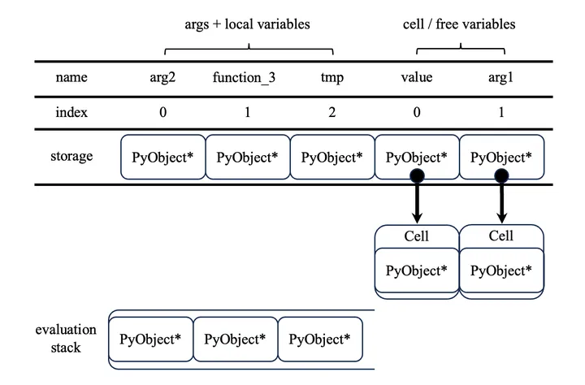
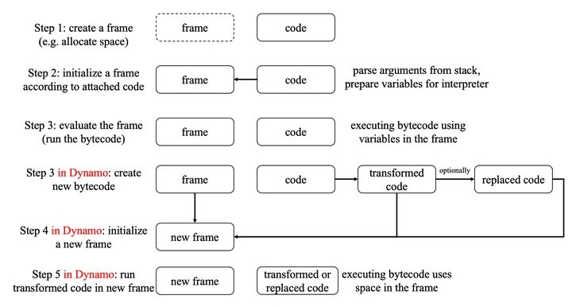

# Python Interpreter
## Reference
- [Python高级知识之解释器执行原理及其在PyTorch中的应用
](https://zhuanlan.zhihu.com/p/670484202)
## 原理
### 变量类型
- global variable(全局变量)
- argument(函数参数)
- local variable(局部变量)
- free variable(自由变量)
- cell variable

python的函数, 类定义可以嵌套. 变量的作用域是由源码决定的(lexical scoping, 或 static scoping),示例:
```
def function_1(arg1):
    def function_2(arg2):
        def function_3(arg3):
            return value + arg3
        # for function_2:
        #   arg1: free variable
        #   arg2: argument
        #   tmp: local variable
        #   value: cell variable used by function_3
        #   global_var: global variable
        tmp = arg1 + arg2
        value = tmp + global_var
        return value + function_3("3 ")
    return function_2

global_var = "global_var "

print(function_1("1 ")("2 "))
```
从`function_2`函数里面向外看, 主要涉及三种:
- 全局变量: 这里的`global_var`
- 函数参数: 这里的`arg2`, 由调用函数传递具体的值
- 自由变量: 这里的`arg1`, 表示非参数且非全局变量的变量(本质上是来自于其它函数的闭包变量)

从`function_2`函数内部看, 主要涉及两种:
- 局部变量: 这里的`tmp`, `function_3`也是
- `cell variable`: 这里的`value`, 在`function_2`函数内诞生, 但是可以在`function_2`函数内部的函数(`function_3`)里面使用
### 变量存储
#### 全局变量
全局变量的存储方式十分简单, 就在当前模块的`__dict__`属性里, 也可以用`globals()`函数获取:
```
a = 1
"a" in globals() # True
```
这里还有个内置变量`builtin variable`的概念. 有一些变量名默认已经赋值了, 具体可以在`builtin`模块里看到:
```
import builtins
"print" in builtins.__dict__
```
#### 其他变量
其他四种变量都存储在函数执行过程中生成的函数帧(frame)里.一般函数参数和局部变量存储在一起, 自由变量和cell variable存储在一起, 两段存储是连续的, 在`frame->f_localsplus`数组里(Python C-API的一部分)
### 函数帧初始化
函数准备执行时, Python解释器会根据要执行的代码(`function_2.__code__`对象)的信息, 创建一个函数帧, 主要包括:
- 存储变量的`localsplus`区域
- 大小上限确定的一个栈(大小为`function_2.__code__.co_stacksize`)


1. 栈的初始化很简单，只需要把全部的元素都置为NULL（空指针）即可
2. localsplus区域则由调用函数（caller）负责初始化。具体来说:
    - 参数（如这里的`arg2`）以及自由变量（例如这里的`arg1`）需要初始化为相应的值
    - 内部变量`tmp`/`function_3`则初始化为NULL（空指针）
    - cell variable: `value`初始化为一个包含空指针的Cell类型的对象
    
function_2函数的帧大概就是上图所示，解释器内部靠变量的下标来识别变量，变量名则是用于调试等目的。**一个变量本质上就是用于标记一个`PyObject*`的指针**（可以指向所有的Python对象），而自由变量、cell variable的指针会指向一种类型为Cell的对象，这个对象内部包含指向具体对象的`PyObject*`指针。
### 字节码执行
函数帧初始化结束后，解释器就可以开始执行每一条字节码指令了。

function_2的字节码如下（可以通过dis模块查看），每一行的格式为：行号（最左边一列，可忽略）、字节码的起始位置（用于控制流跳转）及字节码名字、字节码参数（下标参数及参数名/值）。
```

3           0 LOAD_CLOSURE             0 (value)
              2 BUILD_TUPLE              1
              4 LOAD_CONST               1 (<code object function_3 at 0x11b5602f0, file "blabla.py", line 3>)
              6 LOAD_CONST               2 ('function_1.<locals>.function_2.<locals>.function_3')
              8 MAKE_FUNCTION            8 (closure)
             10 STORE_FAST               1 (function_3)

 11          12 LOAD_DEREF               1 (arg1)
             14 LOAD_FAST                0 (arg2)
             16 BINARY_ADD
             18 STORE_FAST               2 (tmp)

 12          20 LOAD_FAST                2 (tmp)
             22 LOAD_GLOBAL              0 (global_var)
             24 BINARY_ADD
             26 STORE_DEREF              0 (value)

 13          28 LOAD_DEREF               0 (value)
             30 LOAD_FAST                1 (function_3)
             32 LOAD_CONST               3 ('3 ')
             34 CALL_FUNCTION            1
             36 BINARY_ADD
             38 RETURN_VALUE
```

1. 第一条字节码`LOAD_CLOSURE             0 (value)`: 把cell / free variables区域下标为0的Cell对象加载到栈中。此时栈中对象数量为1。
2. 第二条字节码`BUILD_TUPLE              1`: 把栈上的一个对象组装成tuple，这是即将生成的函数function_3的`__closure__`属性的来源。此时栈中对象数量为1。
3. 第三条字节码`LOAD_CONST               1 (<code object xxx>)`: 把一个代码对象加载到栈中，这是即将生成的函数function_3的`__code__`属性的来源。此时栈中对象数量为2。
4. 第四条字节码`LOAD_CONST               2 ('function_1.<locals>.function_2.<locals>.function_3')`: 把一个字符串加载到栈中，这是即将生成的函数function_3的`__name__`属性的来源。此时栈中对象数量为3。栈已经满了。
5. 第五条字节码`MAKE_FUNCTION            8 (closure)`: 将栈中的三个对象组装成一个函数对象。此时栈中对象数量为1。
6. 第六条字节码`STORE_FAST               1 (function_3)`: 将栈上的函数对象存储到localsplus区域下标为1的指针中。此时栈中对象数量为0。
7. 第七条字节码`LOAD_DEREF               1 (arg1)`: 把cell / free variables区域下标为1的Cell对象加载到栈中，并且去掉Cell的包装，将Cell内部的`PyObject*`存储在栈上。此时栈中对象数量为1。
8. 第八条字节码`LOAD_FAST                0 (arg2)`: 将localsplus区域下标为0的对象加载到栈上，此时栈中对象数量为2。
9. 第九条字节码`BINARY_ADD`将栈上两个对象相加，并把结果存储在栈上。此时栈中对象数量为1。
...
## 在PyTorch中的应用
在PyTorch中，`torch.compile`使用的Dynamo功能，会截获Python解释器执行代码的过程。具体如下图所示，Dynamo将第三步截获，通过分析代码，生成一份新的代码对象，同时需要初始化一份新的函数帧，并且用这份新的函数帧来执行新的代码。


PyTorch中新的函数帧的初始化过程，就与上文提到的Python解释器的细节相关。  
理论上，我们需要按照变量名，把旧的函数帧中的参数（argument）及自由变量（free variable）拷贝到新的函数帧中，而新的函数帧中的局部变量及Cell variable属于新的代码的实现细节，新旧函数不必一样。  
然而，PyTorch团队认为函数帧拷贝属于关键代码，非常注重这段代码的性能，因此他们直接将localsplus区域按下标复制到新函数帧的位置。这就导致新的代码必须包含原本代码的全部变量、并且顺序也必须一致。  
因此，我们在对PyTorch生成的字节码进行反编译时，反编译的结果也必须包含原本代码的全部变量。所以反编译的结果会显得比较奇怪：
```
def __transformed_code_0_for_resume_in_toy_function(b, x):
    a = None # this line helps the compiler to generate bytecode with at least the same number of local variables as the original function

    return __compiled_fn_3(x, b)[0]
```